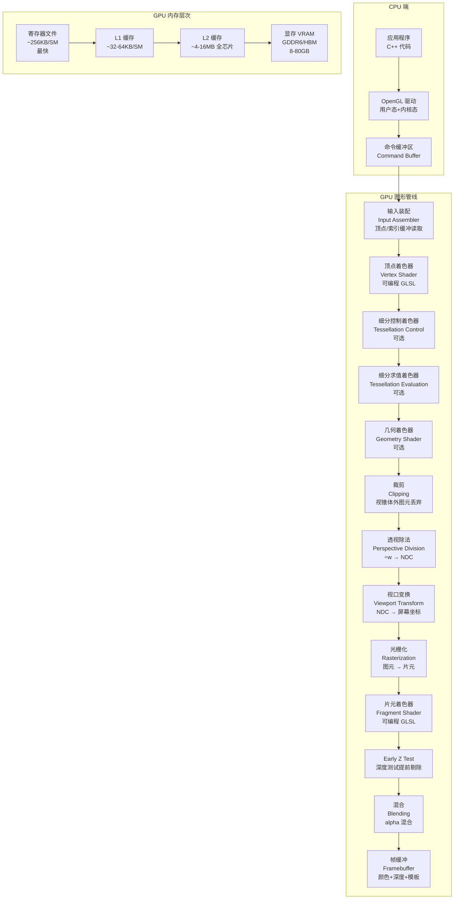

# Module 01 — GPU Pipeline & Hardware Architecture

## 目录

1. [模块目的](#1-模块目的)
2. [架构图：CPU→驱动→GPU 完整管线](#2-架构图cpudriver-gpu-完整管线)
3. [GPU 硬件架构](#3-gpu-硬件架构)
4. [完整图形管线各阶段](#4-完整图形管线各阶段)
5. [光栅化算法详解](#5-光栅化算法详解)
6. [Z-buffer 算法与深度精度](#6-z-buffer-算法与深度精度)
7. [Early Z Test 与延迟渲染动机](#7-early-z-test-与延迟渲染动机)
8. [OpenGL 状态机模型](#8-opengl-状态机模型)
9. [GPU 内存带宽与缓存](#9-gpu-内存带宽与缓存)
10. [常见坑](#10-常见坑)
11. [延伸阅读](#11-延伸阅读)

---

## 1. 模块目的

本模块的目标是在写第一行 OpenGL 代码之前，先在脑海中建立正确的 GPU 心智模型。

很多人学 OpenGL 的路径是：复制粘贴 hello triangle → 运行成功 → 继续复制更多代码。这种方式能产出程序，但无法解释"为什么这样做"，更无法在出错时诊断问题，也无法在性能瓶颈时做出正确判断。

正确的起点是理解：

- **GPU 是什么硬件**：它和 CPU 的根本区别是什么，为什么它擅长并行渲染
- **图形管线是什么**：从 CPU 端的顶点数组到屏幕上显示的像素，经过了哪些阶段
- **OpenGL 是什么接口**：它是状态机，不是函数库，理解这个模型可以避免大量 bug
- **数据在哪里**：显存、缓存、寄存器文件的层次结构，决定了什么操作快什么操作慢

本模块包含一个诊断程序 `query_gpu_info`，它通过 OpenGL 查询 GPU 的各种限制参数（最大纹理尺寸、最大 UBO 大小、着色器存储块限制等），帮助你理解实际硬件的约束。

---

## 2. 架构图：CPU→Driver→GPU 完整管线



### 关键路径说明

**CPU→驱动**：应用程序调用 `glDrawArrays` 等 API，驱动将这些调用转换为 GPU 能理解的命令，写入命令缓冲区（ring buffer），通过 DMA 提交给 GPU。这个过程涉及：
- 状态验证（驱动检查 OpenGL 状态机是否合法）
- 命令序列化（多个 API 调用可能被批量合并）
- 同步点管理（fence/semaphore）

**驱动是性能的隐患**：过多的 draw call（每帧数千次 glDraw*）会让驱动层成为 CPU 瓶颈，即使 GPU 本身没有满载。这是现代图形 API（Vulkan/D3D12/Metal）设计的主要动机之一。

---

## 3. GPU 硬件架构

### 3.1 流式多处理器（SM / CU）

GPU 的计算核心不是单个的大核心，而是大量小型处理单元的集合。NVIDIA 称为 **SM（Streaming Multiprocessor）**，AMD 称为 **CU（Compute Unit）**。

一个现代 GPU 通常包含：
- NVIDIA Ada Lovelace（RTX 4090）：128 个 SM，总计 16,384 个 CUDA 核心
- AMD RDNA 3（RX 7900 XTX）：96 个 CU，总计 12,288 个流处理器

每个 SM/CU 包含：
- 多个 CUDA 核心 / 着色器处理器（通常 128 个/SM）
- 寄存器文件（Register File）：约 256KB，按 warp 分配
- L1 缓存 / 共享内存（可配置比例）
- 纹理单元（TMU）
- 光栅化操作单元（ROP，通常在 SM 外层）

### 3.2 Warp / Wavefront：GPU 的执行单位

GPU 不是以单个线程为单位执行指令的。NVIDIA 的执行单位是 **warp**，AMD 的是 **wavefront**。

- **NVIDIA warp**：32 个线程，总是同时执行同一条指令
- **AMD wavefront**：在 GCN 架构是 64 个线程，RDNA 架构引入了 wave32 模式（32 线程）

这意味着：
```
当 warp 中的 32 个线程执行 if-else 语句时：
  if (condition) {
      // 路径A：部分线程满足
  } else {
      // 路径B：其余线程不满足
  }

GPU 实际执行过程：
  Step 1: 执行路径A，不满足条件的线程被掩码屏蔽（不写结果）
  Step 2: 执行路径B，满足条件的线程被掩码屏蔽
  总时间 = 路径A时间 + 路径B时间（而非 max）
```

这就是 **分支发散（Branch Divergence）** 问题，着色器中应尽量避免 warp 内的分支发散。

### 3.3 SIMD 宽度

每个 SM 内部的计算单元是 SIMD（Single Instruction Multiple Data）架构：
- 一条指令同时操作 warp 的 32 个线程
- 对于 vec4 操作，实际是 32×4 = 128 个标量并行计算
- FP32 峰值算力 = SM数 × 核心数/SM × 频率 × 2（FMA）

### 3.4 寄存器文件

每个 SM 有固定大小的寄存器文件（通常 64K 个 32bit 寄存器，即 256KB）。

寄存器是按 warp 静态分配的：
- 如果每个线程用 32 个寄存器，一个 SM 可以驻留 64K/32 = 2048 个线程 = 64 个 warp
- 如果每个线程用 64 个寄存器，只能驻留 32 个 warp
- warp 数量影响 **占用率（Occupancy）**，占用率低意味着延迟隐藏能力弱

着色器"寄存器溢出"（register spilling）会导致寄存器数据写入 L1/L2 缓存，性能大幅下降。

### 3.5 内存层次

| 层次 | 容量 | 延迟 | 带宽 |
|------|------|------|------|
| 寄存器 | 256KB/SM | ~1 cycle | 极高 |
| L1 缓存/共享内存 | 32-128KB/SM | 20-30 cycles | 数 TB/s |
| L2 缓存 | 4-96MB 全芯片 | 100-200 cycles | ~3 TB/s |
| 显存 GDDR6X | 12-24GB | 400-800 cycles | ~1 TB/s |
| 系统内存（PCIe） | GBs | 数千 cycles | ~32 GB/s |

注意：L1 缓存和共享内存通常共享同一块 SRAM，可通过配置划分比例。

---

## 4. 完整图形管线各阶段

### 4.1 顶点装配（Input Assembly）

从 VBO（顶点缓冲对象）和 IBO/EBO（索引缓冲对象）中读取顶点数据，组装成图元（点/线/三角形）。

- VAO 记录了顶点属性的格式（位置、步长、偏移），由此确定如何从字节流中解析顶点
- 索引缓冲允许顶点复用（一个顶点被多个三角形共享时，只存储一次）

### 4.2 顶点着色器（Vertex Shader）

**完全可编程**，每个顶点执行一次，主要职责：
- 将顶点从模型空间变换到裁剪空间：`gl_Position = MVP * vertex_position`
- 传递插值数据（法线、UV、颜色）到后续阶段

顶点着色器的输出在裁剪空间（Clip Space），坐标是齐次坐标 `(x, y, z, w)`。

### 4.3 细分着色器（Tessellation，可选）

分为两阶段：
- **TCS（Tessellation Control Shader）**：决定每个 patch 的细分级别
- **TES（Tessellation Evaluation Shader）**：对细分后的新顶点计算位置

用于 LOD（细节层次）、地形渲染、曲面细分等场景。

### 4.4 几何着色器（Geometry Shader，可选）

输入一个图元（三角形/线段/点），可输出零个或多个图元。用于：
- 阴影体（Shadow Volume）生成
- Cube Map 的六面一次渲染（layered rendering）
- 点精灵（Point Sprite）展开

注意：GS 在现代 GPU 上通常是性能"陷阱"，因为它破坏了 GPU 的流水线并行性。多数情况下应用 compute shader 替代。

### 4.5 裁剪（Clipping）

在裁剪空间中，将超出视锥体的图元裁剪。视锥体的六个平面在齐次坐标下表示为：
```
-w ≤ x ≤ w
-w ≤ y ≤ w
-w ≤ z ≤ w  （OpenGL 默认，DX 是 0≤z≤w）
```

被视锥体截断的三角形会被分割成新三角形。

### 4.6 透视除法（Perspective Division）

将裁剪坐标 `(x, y, z, w)` 除以 `w`，得到 NDC（归一化设备坐标）：
```
NDC = (x/w, y/w, z/w)  ∈ [-1, 1]³
```

注意这个步骤是硬件固定的，不可编程。

### 4.7 视口变换（Viewport Transform）

将 NDC `[-1,1]²` 映射到屏幕像素坐标，由 `glViewport(x, y, width, height)` 定义：
```
screen_x = (NDC_x + 1) / 2 * width  + x
screen_y = (NDC_y + 1) / 2 * height + y
```

### 4.8 光栅化（Rasterization）

将几何图元（三角形）转换为离散的片元（Fragment）。详见第 5 节。

### 4.9 片元着色器（Fragment Shader）

**完全可编程**，每个片元执行一次，主要职责：
- 计算最终颜色（光照、纹理采样、材质）
- 可选：修改深度值（`gl_FragDepth`）
- 可选：丢弃片元（`discard`）

片元 ≠ 像素。一个像素可能对应多个片元（多重采样 MSAA），最终深度测试通过的片元才写入像素。

### 4.10 深度测试与模板测试

深度测试：比较片元的深度值与深度缓冲中已存的值，决定是否覆盖：
```cpp
glEnable(GL_DEPTH_TEST);
glDepthFunc(GL_LESS);  // 默认：更近的片元通过测试
```

模板测试：基于模板缓冲的位运算，用于镜面反射、portal、描边等特效。

### 4.11 混合（Blending）

处理透明度（Alpha Blending）：
```
result = src_color * src_factor + dst_color * dst_factor
```

常用设置（标准 Alpha 混合）：
```cpp
glEnable(GL_BLEND);
glBlendFunc(GL_SRC_ALPHA, GL_ONE_MINUS_SRC_ALPHA);
```

**重要**：半透明物体必须从远到近排序后渲染，否则混合结果不正确。这是图形引擎中"透明排序"问题的根源。

---

## 5. 光栅化算法详解

### 5.1 扫描线算法

经典的三角形光栅化基于扫描线（scanline）：

1. 确定三角形的 y 范围 `[y_min, y_max]`
2. 对每条水平扫描线 y，计算三角形与该扫描线的两个交点 `x_left` 和 `x_right`
3. 填充 `[x_left, x_right]` 范围内的所有像素

```
顶点排序（按 y）：   A(x0,y0) <= B(x1,y1) <= C(x2,y2)

对于扫描线 y（y0 ≤ y ≤ y1）：
  x_left  = x0 + (x1-x0) * (y-y0)/(y1-y0)   // 边 AB
  x_right = x0 + (x2-x0) * (y-y0)/(y2-y0)   // 边 AC

对于扫描线 y（y1 ≤ y ≤ y2）：
  x_left  = x1 + (x2-x1) * (y-y1)/(y2-y1)   // 边 BC
  x_right = x0 + (x2-x0) * (y-y0)/(y2-y0)   // 边 AC
```

### 5.2 重心坐标推导（面积法）

对于三角形 `P0P1P2` 内的点 P，重心坐标 `(λ0, λ1, λ2)` 满足：

```
P = λ0·P0 + λ1·P1 + λ2·P2
λ0 + λ1 + λ2 = 1
```

用面积法计算：
```
λ0 = Area(P, P1, P2) / Area(P0, P1, P2)
λ1 = Area(P0, P, P2) / Area(P0, P1, P2)
λ2 = Area(P0, P1, P) / Area(P0, P1, P2)
```

三角形面积用叉积（2D 叉积的 z 分量，即有符号面积）：
```
Area(A, B, C) = 0.5 * | (B-A) × (C-A) |
             = 0.5 * | (Bx-Ax)(Cy-Ay) - (By-Ay)(Cx-Ax) |
```

展开后的高效计算公式：
```
denom = (P1y-P2y)*(P0x-P2x) + (P2x-P1x)*(P0y-P2y)

λ0 = ((P1y-P2y)*(Px-P2x) + (P2x-P1x)*(Py-P2y)) / denom
λ1 = ((P2y-P0y)*(Px-P2x) + (P0x-P2x)*(Py-P2y)) / denom
λ2 = 1 - λ0 - λ1
```

当所有 λ ∈ [0,1] 时，点 P 在三角形内。

### 5.3 顶点属性插值

光栅化过程中，顶点属性（颜色、UV、法线等）需要在片元间插值。

**线性插值（屏幕空间）**：直接用重心坐标插值属性 A：
```
A_frag = λ0·A0 + λ1·A1 + λ2·A2
```

这对于颜色等线性属性是正确的，但对 UV 坐标有问题。

### 5.4 透视正确插值推导

问题：透视变换后，屏幕空间的重心坐标不等于世界空间的重心坐标。直接插值 UV 会在透视下产生扭曲（perspective-incorrect interpolation）。

推导：设顶点的裁剪坐标为 `(xi, yi, zi, wi)`，则 NDC 深度为 `zi/wi`，屏幕 z 的倒数为 `1/z_clip`。

关键性质：**1/w 在屏幕空间是线性的**。

设 `Ai` 是顶点属性，透视正确插值为：

```
// 先对 A/w 和 1/w 分别线性插值：
(A/w)_interp = λ0*(A0/w0) + λ1*(A1/w1) + λ2*(A2/w2)
(1/w)_interp = λ0*(1/w0)  + λ1*(1/w1)  + λ2*(1/w2)

// 然后还原 A：
A_frag = (A/w)_interp / (1/w)_interp
```

这就是为什么插值 UV 时 GPU 内部是在 1/w 空间做线性插值后再还原，而不是简单的重心插值。

OpenGL 的 `smooth`（默认）限定符就执行透视正确插值，`noperspective` 则做线性插值（有时用于屏幕空间效果）。

---

## 6. Z-buffer 算法与深度精度

### 6.1 基本 Z-buffer 算法

Z-buffer（深度缓冲）是一个与帧缓冲等大的浮点（或定点）缓冲区，初始值为 1.0（最远）。

```
对每个片元 (x, y)，深度值 z_frag：
  if z_frag < z_buffer[x][y]:
      z_buffer[x][y] = z_frag
      color_buffer[x][y] = fragment_color
  else:
      丢弃该片元
```

### 6.2 深度非线性原因

透视投影矩阵将观察空间的 z 映射到 NDC z（[-1,1]），映射是非线性的：

```
设观察空间 z_eye（沿 -z 方向，取正值），near=n，far=f

z_NDC = -(f+n)/(f-n) - 2fn/((f-n)·z_eye)
      = (f+n)/(f-n) + 2fn/((f-n)·(-z_eye))   // 注意符号
```

这个映射在 near 平面附近精度很高，在 far 平面附近精度急剧下降。

具体来说，深度缓冲精度被压缩到靠近相机的小范围内：
- near=0.1, far=1000 时，约 99% 的深度精度用于 [0.1, 10] 范围
- 而 [10, 1000] 范围只有约 1% 的精度

### 6.3 Z-fighting

当两个面非常接近（例如贴花（Decal）贴在墙上），它们的深度值在深度缓冲中可能由于精度不足而"来回翻转"，表现为闪烁（flickering）。

解决方案：
1. 增大 near 平面（near 越大，近处精度越高，但会裁掉近处物体）
2. 使用 `glPolygonOffset` 为贴花添加偏移
3. 使用 Reverse-Z

### 6.4 Reverse-Z 改进

Reverse-Z 将深度映射反转：near 面映射到 1.0，far 面映射到 0.0。

结合浮点数的特性：浮点数在 [0, 1] 范围内在接近 0 时精度更高（因为 IEEE 754 指数部分的分布），而 Reverse-Z 恰好将远处（本应精度低）映射到接近 0，从而获得更均匀的深度精度分布。

```cpp
// 使用 Reverse-Z 时的设置：
glClipControl(GL_LOWER_LEFT, GL_ZERO_TO_ONE);  // 深度范围 [0,1]
glDepthFunc(GL_GREATER);                        // 更大值通过（反转）
glClearDepth(0.0f);                             // 清除为最远（0）
```

实测：Reverse-Z 可以将精度提升约 2-3 个数量级，几乎完全消除 Z-fighting。

---

## 7. Early Z Test 与延迟渲染动机

### 7.1 Early Z Test

传统管线中，深度测试在片元着色器之后进行。问题：如果一个被遮挡的片元执行了代价昂贵的片元着色器（复杂光照计算），然后深度测试失败被丢弃，这些计算全部浪费。

**Early Z（也叫 Pre-Z）**：在片元着色器之前就执行深度测试：
- 驱动/硬件可以自动检测着色器不修改深度（`gl_FragDepth` 未写入且无 `discard`），启用 Early Z
- 大量被遮挡片元在进入着色器之前就被剔除，节省 shader 执行开销

要利用 Early Z：
1. 不要在着色器中写入 `gl_FragDepth`（除非必要）
2. 不要使用 `discard`（除非必要，例如 alpha test）
3. 对不透明物体从前到后排序渲染（front-to-back），使前面的物体先写入深度缓冲

### 7.2 Overdraw 问题

Overdraw = 同一像素被多次着色。在复杂场景中，屏幕上的每个像素可能被数十个三角形覆盖，如果没有 Early Z，每个三角形的片元都执行着色器，浪费巨大。

测量 overdraw：
```cpp
// 用颜色混合可视化 overdraw：每次绘制加一个微小的亮度增量
// 最终颜色越亮，overdraw 越严重
glBlendFunc(GL_ONE, GL_ONE);  // 加法混合
```

### 7.3 延迟渲染（Deferred Shading）动机

在前向渲染（Forward Rendering）中：
```
对每个物体：
  对每个光源：
    执行着色计算
复杂度 = O(物体数 × 光源数 × overdraw)
```

当场景中有大量动态光源时（城市夜景可能有数千个光源），前向渲染代价极高。

**延迟渲染**分为两个 pass：
1. **Geometry Pass**：渲染所有不透明物体的几何信息到 G-Buffer（几何缓冲），存储：位置、法线、颜色、材质参数。着色器极轻量，几乎无光照计算。
2. **Lighting Pass**：对屏幕上每个像素，从 G-Buffer 读取几何信息，执行所有光源的光照计算。

复杂度从 `O(物体 × 光源 × overdraw)` 降低到 `O(像素 × 光源)`，overdraw 消失（G-Buffer 阶段 Early Z 已剔除），光照计算只对最终可见像素执行。

代价：G-Buffer 带宽消耗大、不支持 MSAA（需要特殊处理）、不支持半透明物体。

---

## 8. OpenGL 状态机模型

### 8.1 核心概念

OpenGL 本质上是一个**巨大的全局状态机**。每个 OpenGL 上下文（context）维护着数百个状态变量，渲染行为由当前状态决定。

**Bind-to-Use 模式**：
```
glBindTexture(GL_TEXTURE_2D, my_texture);  // 绑定到目标
glTexImage2D(GL_TEXTURE_2D, ...);          // 操作"当前绑定到该目标的对象"
```

你不是直接操作对象，而是先绑定到一个"绑定点"（binding point），然后对该绑定点操作。

### 8.2 OpenGL 对象三要素

**名称（Name）**：一个 `GLuint` 整数 ID，通过 `glGen*` 分配：
```cpp
GLuint texture_id;
glGenTextures(1, &texture_id);  // texture_id = 某个正整数，例如 3
```
注意：`glGenTextures` 只分配名称，不分配 GPU 内存。第一次 `glBindTexture` 时对象才真正创建。

**目标（Target）**：同一类对象的不同"插槽"：
```cpp
GL_TEXTURE_2D        // 2D 纹理目标
GL_TEXTURE_3D        // 3D 纹理目标
GL_TEXTURE_CUBE_MAP  // 立方体贴图目标
// 这些是同一类对象（纹理）的不同绑定点
```

**状态（State）**：对象内部存储的所有属性（纹理数据、采样参数、过滤模式等）。

### 8.3 状态机的常见问题

状态机模型的最大问题是**状态泄漏**：

```cpp
// 错误示例：忘记解绑
glBindTexture(GL_TEXTURE_2D, texture_A);
render_object_A();
// 忘记解绑！
render_object_B();  // 意外使用了 texture_A！
```

最佳实践：
1. 渲染前显式绑定所需资源
2. 使用 VAO 封装顶点状态（VAO 记录了 VBO 绑定和属性配置）
3. 使用 DSA（Direct State Access，OpenGL 4.5+）避免绑定：
   ```cpp
   // 传统方式：
   glBindTexture(GL_TEXTURE_2D, tex);
   glTexParameteri(GL_TEXTURE_2D, GL_TEXTURE_MIN_FILTER, GL_LINEAR);

   // DSA 方式（无需绑定）：
   glTextureParameteri(tex, GL_TEXTURE_MIN_FILTER, GL_LINEAR);
   ```

---

## 9. GPU 内存带宽与缓存

### 9.1 纹理采样为什么是瓶颈

纹理采样的代价来源：
1. 纹理数据通常存在显存（VRAM）中
2. 每次纹理采样可能触发缓存缺失（Cache Miss），需要从显存读取数据
3. 显存带宽虽然很高（RTX 4090 约 1008 GB/s），但对于大量纹理采样仍可能成为瓶颈
4. 随机访问（mipmap 采样）对缓存不友好

### 9.2 Cache Line 与访问模式

GPU 的 L1 缓存以 cache line 为单位（通常 128 bytes）。

**顺序访问（良好）**：
- 读取连续内存地址 → 一次 cache miss 后后续访问命中缓存 → 高效

**随机访问（差）**：
- 纹理坐标分散 → 每次采样都可能 cache miss → 大量带宽消耗

### 9.3 纹理 Tile 布局

GPU 纹理在内存中不是简单的行优先存储，而是 **Tile 布局（Morton/Z-order curve）**：

```
线性布局（差）：
  [0,0][1,0][2,0][3,0]   行 0
  [0,1][1,1][2,1][3,1]   行 1
  ...
  访问 [0,0] 和 [0,1] 时，它们相距 width 个像素，可能不在同一缓存行

Tile 布局（好，4x4 tile）：
  [0,0][1,0][0,1][1,1]   2x2 tile 0
  [2,0][3,0][2,1][3,1]   2x2 tile 1
  ...
  访问附近的纹素时，它们在内存中也相邻 → 缓存友好
```

Z-order curve（莫顿编码）将 2D 坐标交错编码为 1D 索引，使得 2D 空间上相邻的像素在 1D 内存中也倾向于相邻。

### 9.4 Mipmap 的带宽意义

Mipmap 不只是为了防止走样（aliasing），也有重要的缓存效率价值：
- 远处物体的纹理如果使用全分辨率，采样时会跨越大范围内存 → 缓存命中率低
- Mipmap 选择合适级别后，采样的纹素紧密相邻 → 缓存友好

永远不要跳过 `glGenerateMipmap`（或等效设置），否则远处物体不仅有走样，还有性能损失。

---

## 10. 常见坑

### 坑 1：GPU 隐式同步（最严重的性能坑）

当 CPU 在 GPU 还未完成渲染时强制读取 GPU 资源，驱动会插入隐式同步，导致 CPU 等待 GPU（或 GPU 等待 CPU）：

```cpp
// 每帧结束时更新 UBO：
glBindBuffer(GL_UNIFORM_BUFFER, ubo);
glBufferSubData(...);  // 如果 GPU 还在使用这个 UBO，驱动会等待！
```

解决：使用多缓冲（double/triple buffering）、`glFenceSync`、`glMapBufferRange` with `GL_MAP_UNSYNCHRONIZED_BIT`。

### 坑 2：Overdraw 导致性能崩溃

复杂 UI 或粒子系统中大量半透明物体叠加，overdraw 可达 10x 以上。解决：
- 不透明物体从前到后排序
- 使用 Early Z Pass
- 减少不必要的全屏后处理

### 坑 3：Texture Thrashing（纹理抖动）

每帧绑定大量不同纹理，超出 L2 缓存容量，导致缓存反复失效：

```cpp
// 糟糕：每个 draw call 绑定不同纹理
for (auto& obj : objects) {
    glBindTexture(GL_TEXTURE_2D, obj.texture);  // 每次都可能导致缓存失效
    draw(obj);
}
```

解决：纹理图集（Texture Atlas）、数组纹理（`GL_TEXTURE_2D_ARRAY`）、按材质排序 draw call（减少纹理切换）。

### 坑 4：分支发散（Branch Divergence）

片元着色器中大量的 `if-else` 或 `for(n)` 循环（n 不固定），导致 warp 内线程走不同路径。解决：
- 用数学函数替代分支（`mix`、`step`、`smoothstep`）
- 将分支中不变的计算提到 CPU 端（通过 uniform）
- 对于必要的分支，确保 warp 内线程走相同路径（相邻像素通常颜色/材质相近）

### 坑 5：Shared Memory Bank Conflict（Compute Shader）

在 Compute Shader 中使用 `shared` 内存时，如果 warp 内 32 个线程同时访问同一 bank 的不同地址，发生 bank conflict，访问序列化。解决：对访问模式增加 padding。

### 坑 6：过度使用 glGetError

`glGetError` 是同步操作，它强制等待 GPU 完成所有命令。每帧调用会导致性能大幅下降：
```cpp
// 仅在调试时使用，发布版本中移除：
#ifdef DEBUG
    GLenum err = glGetError();
    if (err != GL_NO_ERROR) { ... }
#endif
```

更好的方案：使用 `GL_DEBUG_OUTPUT` 和调试回调（第 7 节），它是异步的，不会阻塞 GPU。

---

## 11. 延伸阅读

### 书籍

- **Real-Time Rendering, 4th Edition** — Tomas Möller, Eric Haines, Naty Hoffman
  图形领域最权威的综合参考书，第 2 章 The Graphics Rendering Pipeline 对应本模块内容

- **GPU Gems 1/2/3** — NVIDIA（免费在线阅读）
  https://developer.nvidia.com/gpugems/gpugems/foreword
  大量实用技术文章，GPU Gems 3 的 Depth-of-Field 和 Shadow Volume 章节尤其经典

- **Physically Based Rendering: From Theory to Implementation** — Matt Pharr
  http://www.pbr-book.org/
  光线追踪和 PBR 的圣经，理解 GPU 渲染的物理基础

### 白皮书与规范

- **NVIDIA Turing Architecture Whitepaper**
  https://images.nvidia.com/akamai/technology/turing/turing-architecture-whitepaper.pdf
  详细介绍 SM 架构、Tensor Core、RT Core

- **AMD RDNA 3 Architecture**
  https://www.amd.com/en/technologies/rdna-3

- **OpenGL 4.6 Core Profile Specification**
  https://registry.khronos.org/OpenGL/specs/gl/glspec46.core.pdf
  原始规范，第 14 章（光栅化）和第 17 章（帧缓冲操作）对应本模块

### 文章与教程

- **A trip through the Graphics Pipeline** — Fabian "ryg" Giesen
  https://fgiesen.wordpress.com/2011/07/09/a-trip-through-the-graphics-pipeline-2011-index/
  极其深入的图形管线剖析，从 D3D11 角度，原理与 OpenGL 完全相通

- **Render Hell** — Simon Trümpler
  https://simonschreibt.de/gat/renderhell/
  以可视化方式讲解常见渲染问题

- **Reverse-Z (and why it's so great)** — Nathan Reed
  https://nlguillemot.wordpress.com/2016/12/07/reversed-z-in-opengl/
  Reverse-Z 的详细推导和实现

- **How OpenGL works: software renderer from scratch** — tsodinPog
  YouTube 视频系列，从零实现软件光栅化，帮助理解硬件做了什么

### 工具

- **RenderDoc** — https://renderdoc.org/
  最优秀的图形调试工具，可以帧捕获、检查每个 drawcall 的状态、查看 G-Buffer

- **NVIDIA Nsight Graphics** — https://developer.nvidia.com/nsight-graphics
  GPU 性能分析，查看 SM 占用率、内存带宽、着色器耗时

- **AMD Radeon GPU Profiler** — https://gpuopen.com/rgp/
  AMD GPU 的对应工具

---

*本模块配套代码：`src/query_gpu_info.cpp` — 查询并打印当前 GPU 的 OpenGL 限制参数。*
*构建：`CXX=g++-10 CC=gcc-10 cmake -B build && cmake --build build -j$(nproc)`*
*运行：`./build/module01_query_gpu`*
