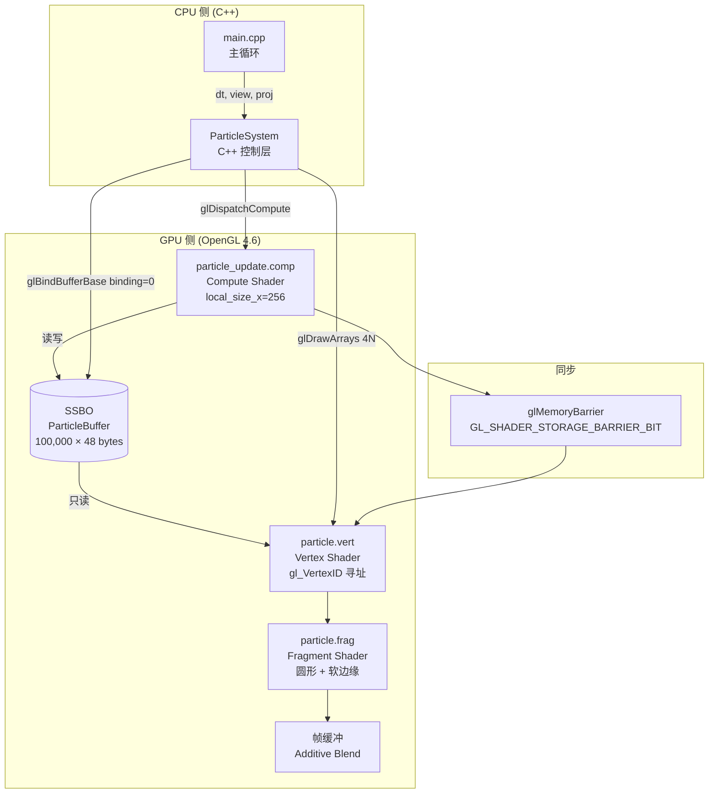
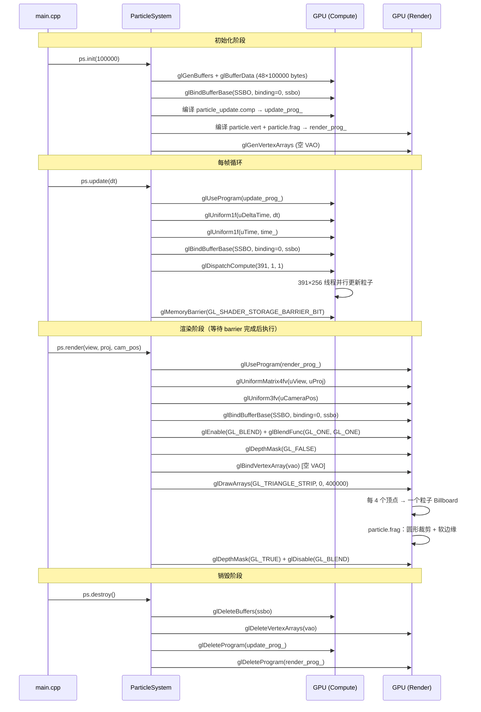

# Module 15 — GPU 粒子系统 (GPU Particle System)

> OpenGL 4.6 | Compute Shader | SSBO | Billboard Rendering | 10 万粒子实时模拟

---

## 1. 模块目的与背景

### 1.1 目标

本模块通过构建一个完整的 **GPU 粒子系统**，掌握以下核心技术：

- **Compute Shader**：在 GPU 上并行更新粒子状态，彻底绕开 CPU-GPU 数据往返的瓶颈
- **Shader Storage Buffer Object (SSBO)**：以 std430 布局存储大规模粒子数据，供 Compute Shader 和顶点着色器共享读写
- **Billboard 渲染**：无顶点缓冲（空 VAO）的 instanced 四边形，始终朝向相机
- **加法混合（Additive Blending）**：实现发光、火焰、魔法等粒子视觉效果

完成后的效果：**10 万粒子喷泉**，粒子从原点射出、受重力下落、死亡后重置，稳定运行于 60 FPS 以上。

### 1.2 为什么需要 Compute Shader

传统 CPU 粒子系统的瓶颈在于：

| 步骤 | 传统 CPU 方案 | GPU Compute 方案 |
|------|--------------|-----------------|
| 粒子数量上限 | ~1 万（受 CPU 带宽限制） | 百万级 |
| 每帧数据流向 | CPU 写 → VBO 上传 → GPU 读 | 数据常驻 GPU，SSBO 读写 |
| 并发度 | 单线程 / 少量线程 | 10 万线程同时执行 |
| 物理积分 | 串行 for 循环 | 每粒子一个线程，完全并行 |

OpenGL 4.3 引入 Compute Shader，4.6 进一步优化 SSBO 性能。本模块要求 OpenGL 4.6 Core Profile。

### 1.3 粒子生命周期概览

```
初始化
  │  随机 position/velocity/color 写入 SSBO
  ▼
每帧 update（Compute Shader）
  │  age += dt
  │  若 age >= life_max → 重置到发射点（Respawn）
  │  否则 → 物理积分（velocity + gravity，position + velocity*dt）
  │         alpha 随年龄线性衰减
  ▼
每帧 render（Vert + Frag Shader）
  │  从 SSBO 读取每粒子数据（无顶点属性，gl_VertexID 寻址）
  │  Billboard：用 View 矩阵的 right/up 列展开四边形
  │  加法混合输出到帧缓冲
  ▼
粒子销毁
     glDeleteBuffers / glDeleteProgram
```

---

## 2. 架构图



**关键数据流**：

1. `ParticleSystem::init` — 在 CPU 生成初始粒子数组，一次性上传到 SSBO，之后 CPU 不再接触粒子数据
2. `ParticleSystem::update` — 调用 `glDispatchCompute`，GPU 上 Compute Shader 并行更新所有粒子
3. `glMemoryBarrier` — 确保 Compute Shader 写操作对后续顶点着色器可见
4. `ParticleSystem::render` — 顶点着色器通过 `gl_VertexID / 4` 索引到 SSBO 中的粒子数据，展开 Billboard 四边形

---

## 3. 关键类与文件表

### 3.1 文件结构

```
module15_particles/
├── include/
│   └── particle_system.h        # ParticleSystem 类声明 + Particle 结构体
├── src/
│   ├── particle_system.cpp      # init / update / render / destroy 实现
│   └── main.cpp                 # GLFW 主循环、相机控制
└── shaders/
    ├── particle_update.comp     # Compute Shader：并行粒子物理更新
    ├── particle.vert            # 顶点着色器：Billboard 展开
    └── particle.frag            # 片段着色器：圆形软粒子 + 加法混合
```

### 3.2 关键类与结构体

| 类 / 结构体 | 文件 | 职责 |
|-------------|------|------|
| `Particle` | `particle_system.h` | GPU 粒子数据布局，与 GLSL std430 严格对齐 |
| `ParticleSystem` | `particle_system.h / .cpp` | 管理 SSBO、两个 GL 程序，暴露 init/update/render/destroy |
| `main()` | `main.cpp` | GLFW 窗口、主循环、相机 WASD+RMB 控制 |

### 3.3 Particle 结构体详解

```cpp
// C++ 侧（particle_system.h）
struct Particle {
    glm::vec4 position;   // xyz = 世界坐标, w = age（当前年龄，秒）
    glm::vec4 velocity;   // xyz = 速度向量, w = life_max（最大寿命，秒）
    glm::vec4 color;      // rgba（alpha 随年龄线性衰减）
};
// sizeof(Particle) = 3 × 16 = 48 bytes
```

```glsl
// GLSL 侧（std430 布局）
struct Particle {
    vec4 position;   // 对齐 16 bytes，与 C++ glm::vec4 完全匹配
    vec4 velocity;
    vec4 color;
};
```

`vec4` 在 std430 下对齐 16 字节，`glm::vec4` 同样 16 字节对齐，二者内存布局完全一致，无需额外 padding。

### 3.4 GL 对象清单

| GL 对象 | 变量名 | 用途 |
|---------|--------|------|
| `GL_SHADER_STORAGE_BUFFER` | `ssbo` | 存储全部 10 万粒子，binding point = 0 |
| `GL_VERTEX_ARRAY` (空) | `vao` | 无顶点属性，仅占位以满足 Core Profile 要求 |
| `GL_COMPUTE_PROGRAM` | `update_prog_` | particle_update.comp |
| `GL_PROGRAM` | `render_prog_` | particle.vert + particle.frag |

---

## 4. 核心算法

### 4.1 粒子初始化算法

```
INPUT: n = 100000

FOR i = 0 TO n-1:
    age      = random(0, 8.0)          // 随机初始年龄，避免所有粒子同步死亡
    life_max = random(3.0, 8.0)        // 寿命 3~8 秒
    angle    = random(0, 2π)           // 水平方向随机角度（圆锥喷泉）
    speed    = random(2.0, 5.0)        // 水平速度
    vy       = random(5.0, 10.0)       // 垂直初速度（向上）

    particles[i].position = (0, 0, 0, age)
    particles[i].velocity = (cos(angle)*speed, vy, sin(angle)*speed, life_max)
    particles[i].color    = (random_r, random_g, random_b, 1.0)

上传到 SSBO（一次性 glBufferData，之后 CPU 不再访问）
```

### 4.2 Compute Shader 粒子更新算法

每帧调用，每个线程负责一个粒子：

```
DISPATCH: ceil(100000 / 256) = 391 个工作组，每组 256 线程

THREAD idx = gl_GlobalInvocationID.x:
    IF idx >= total_particles: RETURN    // 边界保护

    p = particles[idx]
    p.position.w += dt                   // age 递增

    IF p.position.w >= p.velocity.w:     // age >= life_max → 死亡重置
        seed = idx * 1664525 + time*1000 * 22695477   // 基于 idx 和时间的伪随机种子
        angle = hash(seed)     * 2π
        speed = 2.0 + hash(seed+1) * 3.0
        life  = 3.0 + hash(seed+2) * 5.0

        p.position = (0, 0, 0, 0)                     // 回到发射点
        p.velocity = (cos(angle)*speed,
                      5.0 + hash(seed+3)*5.0,
                      sin(angle)*speed,
                      life)
        p.color    = (hash(seed+4), hash(seed+5), hash(seed+6), 1.0)
    ELSE:
        p.velocity.y -= 9.8 * dt                      // 重力
        p.position.xyz += p.velocity.xyz * dt         // 欧拉积分

        t = p.position.w / p.velocity.w               // 归一化生命进度 [0,1]
        p.color.a = 1.0 - t                           // alpha 线性衰减

    particles[idx] = p
```

**GLSL Wang Hash 随机数生成**（无内置 random）：

```
hash(n):
    n = (n << 13) XOR n
    n = n * (n * n * 15731 + 789221) + 1376312589
    RETURN float(n AND 0x7fffffff) / 0x7fffffff     // [0, 1)
```

### 4.3 Billboard 朝向算法

Billboard 的核心问题：世界空间中的四边形需始终正对相机。

**直接从 View 矩阵提取相机方向**（最高效方案）：

View 矩阵的构成（glm::lookAt 输出）：

```
       [  rx   ry   rz   -dot(r,eye) ]
View = [  ux   uy   uz   -dot(u,eye) ]
       [ -fx  -fy  -fz    dot(f,eye) ]
       [  0    0    0       1        ]

其中 r = 相机右方向, u = 相机上方向, f = 相机前方向（均为世界空间单位向量）
```

因此相机右向量和上向量可直接从 View 矩阵的列中读取：

```
cam_right = (View[0][0], View[1][0], View[2][0])  // View 第0列的前3个元素
cam_up    = (View[0][1], View[1][1], View[2][1])  // View 第1列的前3个元素
```

**Billboard 顶点展开**（GLSL 中）：

```
粒子世界中心 = p.position.xyz
四个角偏移（Triangle Strip 顺序）:
  offset[0] = (-0.5,  0.5)  → 左上
  offset[1] = (-0.5, -0.5)  → 左下
  offset[2] = ( 0.5,  0.5)  → 右上
  offset[3] = ( 0.5, -0.5)  → 右下

world_pos = center + cam_right * offset.x * size
                   + cam_up    * offset.y * size

gl_Position = Proj * View * vec4(world_pos, 1.0)
```

`size = 0.15`（世界空间米），固定大小（无距离衰减，发光粒子远近视觉效果差异小）。

### 4.4 颜色与透明度生命周期算法

```
t = age / life_max              // 生命进度，范围 [0, 1)

alpha = 1.0 - t                 // 线性衰减：诞生时 alpha=1，死前 alpha→0

// 片段着色器中（加法混合下 alpha 控制亮度贡献）：
dist  = length(uv - 0.5) * 2   // 到粒子中心的归一化距离 [0, 1]
soft  = 1.0 - dist*dist         // 二次衰减（圆形边缘柔化）
final_alpha = soft * alpha

FragColor = vec4(color.rgb * final_alpha, 1.0)
// 加法混合：dst = dst + src.rgb * final_alpha（src.a 不参与）
```

### 4.5 工作组数量计算

```
local_size_x = 256（在 .comp 中声明）
N = 100000 粒子

work_groups = ceil(N / local_size_x) = ceil(100000 / 256) = 391

glDispatchCompute(391, 1, 1);
// 实际执行线程数 = 391 × 256 = 100096 > 100000
// 超出范围的线程（idx >= 100000）在 shader 开头 early return
```

C++ 中的整数上取整写法：

```cpp
int groups = (max_particles + 255) / 256;   // 等价于 ceil(N/256)
```

---

## 5. 调用时序图



---

## 6. 关键代码片段

### 6.1 Particle 结构体与 SSBO 绑定

```cpp
// include/particle_system.h
struct Particle {
    glm::vec4 position;   // xyz = 位置, w = age（当前年龄）
    glm::vec4 velocity;   // xyz = 速度, w = life_max（最大寿命）
    glm::vec4 color;      // rgba，alpha 随生命周期衰减
};
// sizeof(Particle) = 48 bytes，与 GLSL std430 vec4 对齐规则完全匹配
```

```cpp
// particle_system.cpp — SSBO 创建与绑定
glGenBuffers(1, &ssbo);
glBindBuffer(GL_SHADER_STORAGE_BUFFER, ssbo);
glBufferData(GL_SHADER_STORAGE_BUFFER,
             n * sizeof(Particle),     // 100000 × 48 = 4,800,000 bytes (~4.6 MB)
             init_data.data(),
             GL_DYNAMIC_DRAW);         // GPU 频繁读写（每帧 Compute Shader 更新）

// 将 SSBO 绑定到 binding point 0
// 必须与 GLSL 中 layout(std430, binding = 0) 的 binding 编号一致
glBindBufferBase(GL_SHADER_STORAGE_BUFFER, 0, ssbo);
```

### 6.2 Compute Shader 调度与内存屏障

```cpp
// particle_system.cpp — update 方法
void ParticleSystem::update(float dt) {
    time_ += dt;
    glUseProgram(update_prog_);

    // 传递 uniform（每帧变化量 + 总时间，用于伪随机数种子）
    glUniform1f(glGetUniformLocation(update_prog_, "uDeltaTime"), dt);
    glUniform1f(glGetUniformLocation(update_prog_, "uTime"), time_);

    // 重新绑定 SSBO（确保 binding point 活跃）
    glBindBufferBase(GL_SHADER_STORAGE_BUFFER, 0, ssbo);

    // 计算工作组数：ceil(100000 / 256) = 391
    // Compute Shader 声明 layout(local_size_x = 256)
    int groups = (max_particles + 255) / 256;
    glDispatchCompute(groups, 1, 1);

    // !! 关键：必须在渲染前插入内存屏障 !!
    // 告知 OpenGL：Compute Shader 对 SSBO 的写操作必须在后续
    // 着色器读取 SSBO 之前完成（否则顶点着色器可能读到旧数据）
    glMemoryBarrier(GL_SHADER_STORAGE_BARRIER_BIT);
}
```

### 6.3 Compute Shader 完整逻辑（particle_update.comp）

```glsl
#version 460 core
layout(local_size_x = 256) in;   // 每工作组 256 线程，必须与 C++ dispatch 匹配

struct Particle {
    vec4 position;  // xyz=pos, w=age
    vec4 velocity;  // xyz=vel, w=life_max
    vec4 color;
};

// std430：vec4 按 16 bytes 对齐，与 C++ struct 布局完全一致
layout(std430, binding = 0) buffer ParticleBuffer {
    Particle particles[];
};

uniform float uDeltaTime;
uniform float uTime;

// Wang Hash：GPU 上无内置 random，用整数哈希模拟
float hash(uint n) {
    n  = (n << 13U) ^ n;
    n  = n * (n * n * 15731U + 789221U) + 1376312589U;
    return float(n & uint(0x7fffffff)) / float(0x7fffffff);
}

void main() {
    uint idx   = gl_GlobalInvocationID.x;
    uint total = uint(particles.length());
    if (idx >= total) return;    // 边界检查：391×256=100096 > 100000

    Particle p = particles[idx];
    p.position.w += uDeltaTime;  // 累积年龄

    if (p.position.w >= p.velocity.w) {
        // 死亡重置：使用 idx 和 time 组合生成不同随机序列
        uint s0 = idx * 1664525U + uint(uTime * 1000.0) * 22695477U;

        float angle = hash(s0)       * 6.28318;   // 水平方向 0~2π
        float speed = 2.0 + hash(s0 + 1U) * 3.0; // 水平速度 2~5
        float life  = 3.0 + hash(s0 + 2U) * 5.0; // 寿命 3~8 秒

        p.position = vec4(0.0, 0.0, 0.0, 0.0);   // 回到发射点，age=0
        p.velocity = vec4(cos(angle) * speed,
                          5.0 + hash(s0 + 3U) * 5.0,  // 垂直速度 5~10
                          sin(angle) * speed,
                          life);
        p.color = vec4(hash(s0+4U), hash(s0+5U), hash(s0+6U), 1.0);
    } else {
        // 物理积分（显式欧拉法）
        p.velocity.y -= 9.8 * uDeltaTime;          // 重力 -9.8 m/s²
        p.position.xyz += p.velocity.xyz * uDeltaTime;

        // alpha 随生命进度线性衰减
        float t = p.position.w / p.velocity.w;     // [0, 1)
        p.color.a = 1.0 - t;
    }

    particles[idx] = p;   // 写回 SSBO（同一 buffer，Compute Shader 直接 in-place 修改）
}
```

### 6.4 顶点着色器：空 VAO + gl_VertexID 寻址 Billboard

```glsl
#version 460 core

struct Particle { vec4 position; vec4 velocity; vec4 color; };

// 只读：渲染阶段不需要写 SSBO
layout(std430, binding = 0) readonly buffer ParticleBuffer {
    Particle particles[];
};

uniform mat4 uView;
uniform mat4 uProj;
uniform int  uParticleCount;

out vec4 vColor;
out vec2 vUV;

// 四边形四个角的局部偏移（Triangle Strip 顺序）
const vec2 QUAD_OFFSETS[4] = vec2[](
    vec2(-0.5,  0.5),   // 0: 左上
    vec2(-0.5, -0.5),   // 1: 左下
    vec2( 0.5,  0.5),   // 2: 右上
    vec2( 0.5, -0.5)    // 3: 右下
);
const vec2 QUAD_UVS[4] = vec2[](
    vec2(0.0, 1.0), vec2(0.0, 0.0),
    vec2(1.0, 1.0), vec2(1.0, 0.0)
);

void main() {
    // 空 VAO 技巧：所有几何数据从 SSBO 读取，通过 gl_VertexID 寻址
    // glDrawArrays(GL_TRIANGLE_STRIP, 0, N*4) 产生 N*4 个顶点调用
    int particle_idx = gl_VertexID / 4;   // 每 4 个顶点对应一个粒子
    int corner_idx   = gl_VertexID % 4;   // 当前是四边形的哪个角

    if (particle_idx >= uParticleCount) {
        gl_Position = vec4(0.0);  // 越界：退化三角形（不可见）
        return;
    }

    Particle p = particles[particle_idx];
    vColor = p.color;
    vUV    = QUAD_UVS[corner_idx];

    // Billboard 对齐：从 View 矩阵提取相机右方向和上方向
    // View 矩阵 = [right | up | -forward | translation]（列主序）
    // 注意：GLSL mat4 用列索引：View[col][row]
    vec3 cam_right = vec3(uView[0][0], uView[1][0], uView[2][0]);  // View 第0列
    vec3 cam_up    = vec3(uView[0][1], uView[1][1], uView[2][1]);  // View 第1列

    float size = 0.15;  // 粒子世界空间半径（米）
    vec2  off  = QUAD_OFFSETS[corner_idx];

    // 在世界空间中展开 Billboard 四边形
    vec3 world_pos = p.position.xyz
                   + cam_right * off.x * size
                   + cam_up    * off.y * size;

    gl_Position = uProj * uView * vec4(world_pos, 1.0);
}
```

### 6.5 片段着色器：圆形粒子 + 软边缘

```glsl
#version 460 core

in  vec4 vColor;
in  vec2 vUV;
out vec4 FragColor;

void main() {
    // 以 UV (0.5, 0.5) 为圆心，计算到中心距离的平方（归一化到 [0,1]）
    vec2  d    = vUV - vec2(0.5);      // [-0.5, 0.5]
    float dist = dot(d, d) * 4.0;      // = (|d|/0.5)²，圆形边界在 dist=1

    // 硬裁剪：超出圆形区域的片段直接丢弃
    if (dist > 1.0) discard;

    // 软边缘：alpha = (1 - dist²) * 粒子生命alpha
    // dist=0（圆心）→ alpha 最大；dist=1（边缘）→ alpha=0
    float alpha = (1.0 - dist) * vColor.a;

    // 加法混合模式（GL_ONE, GL_ONE）：
    // 最终颜色 = 帧缓冲现有颜色 + 粒子颜色贡献
    // alpha 被乘进 rgb 中，而不是单独的透明度通道
    FragColor = vec4(vColor.rgb * alpha, 1.0);
}
```

### 6.6 渲染调用：加法混合 + 空 VAO

```cpp
// particle_system.cpp — render 方法关键部分
void ParticleSystem::render(const glm::mat4& view, const glm::mat4& proj,
                             glm::vec3 camera_pos) {
    glUseProgram(render_prog_);

    // 传递矩阵 uniform
    glUniformMatrix4fv(glGetUniformLocation(render_prog_, "uView"),
                       1, GL_FALSE, glm::value_ptr(view));
    glUniformMatrix4fv(glGetUniformLocation(render_prog_, "uProj"),
                       1, GL_FALSE, glm::value_ptr(proj));
    glUniform1i(glGetUniformLocation(render_prog_, "uParticleCount"), max_particles);

    // 重新绑定 SSBO（只读模式，顶点着色器使用）
    glBindBufferBase(GL_SHADER_STORAGE_BUFFER, 0, ssbo);

    // 加法混合：粒子颜色叠加（发光效果）
    glEnable(GL_BLEND);
    glBlendFunc(GL_ONE, GL_ONE);   // dst = dst + src（无透明度混合）

    // 禁用深度写入：加法混合的粒子不应遮挡/被遮挡彼此
    // 深度测试仍然开启（粒子被不透明物体遮挡正常）
    glDepthMask(GL_FALSE);

    // 空 VAO — Core Profile 要求必须绑定 VAO，但无需任何顶点属性
    // 顶点数据完全来自 SSBO + gl_VertexID
    glBindVertexArray(vao);

    // 每粒子 4 个顶点（Triangle Strip 四边形）
    // 总顶点数 = max_particles * 4 = 400000
    glDrawArrays(GL_TRIANGLE_STRIP, 0, max_particles * 4);

    // 恢复状态
    glDepthMask(GL_TRUE);
    glDisable(GL_BLEND);
}
```

---

## 7. 设计决策

### 7.1 为何选择 SSBO 而非 TBO（Texture Buffer Object）

| 特性 | SSBO | TBO |
|------|------|-----|
| 容量上限 | 驱动决定（通常 ≥ 128 MB） | 纹理尺寸上限（通常 128 MB，但格式受限） |
| 随机读写 | 支持，原子操作 | 只读（在着色器中） |
| Compute Shader 写入 | 原生支持 | 不支持直接写入 |
| 数据布局灵活性 | std430，任意 struct | 受纹理 texel 格式限制（vec4, ivec4 等） |
| 适用场景 | 粒子、大型数组、读写共享数据 | 只读大型数组、稀疏数据 |

**结论**：粒子系统需要 Compute Shader 读写同一块数据，SSBO 是唯一合适选择。

### 7.2 为何使用空 VAO + gl_VertexID 而非传统顶点属性

**传统方案**（每帧 CPU 上传）：

```
问题：
- 每帧从 SSBO 读回 CPU → 组装 VBO → 上传 GPU
- PCIe 带宽瓶颈：100000 粒子 × 48 bytes = 4.8 MB/帧
- 60 FPS × 4.8 MB = 288 MB/s PCIe 上行流量
```

**空 VAO + SSBO 方案**：

```
优势：
- 粒子数据常驻 GPU，零 CPU-GPU 数据传输（除 uniform 外）
- Compute Shader 写入后直接被顶点着色器读取，走片上缓存
- 代码更简洁，不需要 VAO 属性配置
```

### 7.3 为何选择 Triangle Strip 而非 Points + Geometry Shader

| 方案 | 优点 | 缺点 |
|------|------|------|
| GL_POINTS + gl_PointSize | 简单 | 尺寸上限受限（驱动限制通常 64px），不能自定义形状，无 UV |
| GL_POINTS + Geometry Shader | 灵活 | Geometry Shader 性能差（串行扩展，破坏 GPU 流水线并行性） |
| Triangle Strip（本方案） | 性能好，可任意 UV，无大小限制 | 每粒子 4 顶点调用（vs. 1 次） |
| GL_TRIANGLE_STRIP + Instancing | 语义清晰 | 需要额外 Instance VBO |

**结论**：Triangle Strip + gl_VertexID 是性能与灵活性的最佳平衡，避免了 Geometry Shader 的性能陷阱。

### 7.4 为何使用显式欧拉积分而非更高阶方法

粒子系统使用**显式欧拉法**（Explicit Euler）：

```
v(t+dt) = v(t) + a*dt
x(t+dt) = x(t) + v(t)*dt
```

而非 Verlet 积分或 Runge-Kutta：

| 方法 | 精度 | GPU 友好性 | 能量守恒 |
|------|------|-----------|---------|
| 显式欧拉 | 一阶 | 极佳（每粒子独立，无历史依赖） | 略微发散 |
| Verlet | 二阶 | 良好（需要上一帧位置） | 较好 |
| RK4 | 四阶 | 较差（4次力评估，需要中间态存储） | 好 |

**结论**：粒子系统重视视觉效果而非物理精度，显式欧拉的轻微不稳定性在视觉上不可察觉，而且对 GPU 并行最友好（每线程完全独立，无状态依赖）。

### 7.5 为何选择 Wang Hash 而非 GLSL noise 函数

GLSL 没有内置随机数函数。常见替代方案：

| 方案 | 质量 | GPU 性能 | 实现复杂度 |
|------|------|---------|----------|
| `fract(sin(x)*43758.5)` | 低（模式明显） | 好 | 一行 |
| Wang Hash（本方案） | 中（满足粒子需求） | 好 | 5 行整数运算 |
| PCG Hash | 高 | 好 | 8 行 |
| Simplex Noise | 高（连续） | 中 | 复杂 |

**结论**：Wang Hash 在整数域运算，无浮点精度问题，质量满足粒子随机化需求，且能基于 `idx * time` 生成稳定可重复的随机序列。

### 7.6 为何加法混合而非 Alpha 混合

| 混合模式 | 公式 | 效果 | 粒子排序要求 |
|---------|------|------|------------|
| Alpha 混合 | dst = src*α + dst*(1-α) | 正确透明度 | 需要从后到前排序（每帧 O(N log N)） |
| 加法混合（本方案） | dst = src + dst | 发光、能量效果 | 无需排序（交换律成立） |
| 预乘 Alpha | dst = src + dst*(1-α) | 正确透明度且更快 | 需要排序 |

**结论**：粒子排序在 GPU 上代价极高（10 万粒子排序需要 Radix Sort Compute Shader），加法混合既省去排序又产生更炫的发光效果，是粒子系统的工业标准选择。

---

## 8. 常见坑

**坑 1：SSBO struct 与 std430 对齐不匹配**

```
症状：粒子位置/颜色数据错乱，粒子跑到错误位置
原因：C++ struct 中存在隐式 padding，与 GLSL std430 期望的内存布局不同

错误示例（会导致 padding）：
struct BadParticle {
    float x, y, z;   // 12 bytes
    // 编译器在此插入 4 bytes padding 以对齐 vec4
    glm::vec4 color;  // 16 bytes，总计 32 bytes（而非 28）
};

正确方案：统一使用 vec4（16 bytes 对齐），所有字段填充到 vec4：
struct Particle {
    glm::vec4 position;  // xyz + w=age，16 bytes，自然对齐
    glm::vec4 velocity;  // xyz + w=life_max，16 bytes
    glm::vec4 color;     // rgba，16 bytes
};                       // 总计 48 bytes，无 padding
```

**坑 2：忘记 glMemoryBarrier 导致渲染读到旧数据**

```
症状：粒子更新延迟一帧，或出现撕裂/重影
原因：Compute Shader 写 SSBO 的操作与顶点着色器读 SSBO 之间没有同步

错误代码：
glDispatchCompute(groups, 1, 1);
// 直接渲染，Compute Shader 可能尚未完成
ps.render(view, proj, cam_pos);

正确代码：
glDispatchCompute(groups, 1, 1);
glMemoryBarrier(GL_SHADER_STORAGE_BARRIER_BIT);  // 必须！
ps.render(view, proj, cam_pos);

注意：GL_SHADER_STORAGE_BARRIER_BIT 仅同步后续着色器对该 buffer 的读取，
不等同于 glFinish()（后者等待所有 GPU 操作完成，过于昂贵）。
```

**坑 3：工作组大小与 shader 声明不一致**

```
症状：部分粒子未更新（越界线程被 early return），或 GL 错误（工作组超出上限）
原因：C++ 中 dispatch 计算使用的 local_size 与 shader 中声明的不一致

shader 声明：  layout(local_size_x = 256) in;
C++ dispatch：int groups = (max_particles + 63) / 64;   // 按 64 算！错误！

正确：
int groups = (max_particles + 255) / 256;  // 必须与 local_size_x 完全一致

验证方式：
glGetIntegeri_v(GL_MAX_COMPUTE_WORK_GROUP_SIZE, 0, &max_local_x)
// 通常 ≥ 1024，256 是安全值
```

**坑 4：加法混合时忘记禁用深度写入**

```
症状：粒子互相遮挡，后面的粒子被前面的粒子挡住（黑色区域）
原因：加法混合时粒子是透明的，但仍写入深度缓冲，导致后续粒子深度测试失败

错误代码（缺少 glDepthMask）：
glEnable(GL_BLEND);
glBlendFunc(GL_ONE, GL_ONE);
glDrawArrays(...);   // 粒子写入深度缓冲，互相遮挡

正确代码：
glEnable(GL_BLEND);
glBlendFunc(GL_ONE, GL_ONE);
glDepthMask(GL_FALSE);    // 关闭深度写入（深度测试仍然开启）
glDrawArrays(...);
glDepthMask(GL_TRUE);     // 渲染完粒子后恢复，以免影响后续不透明物体
```

**坑 5：SSBO binding point 不一致**

```
症状：GL_INVALID_OPERATION，或粒子数据为全零/随机内存
原因：C++ 绑定的 binding point 与 GLSL layout(binding=N) 中的 N 不一致

GLSL：layout(std430, binding = 0) buffer ParticleBuffer { ... };
C++：glBindBufferBase(GL_SHADER_STORAGE_BUFFER, 1, ssbo);  // 绑定到 1，但 shader 用 0！

正确：binding point 必须完全匹配：
glBindBufferBase(GL_SHADER_STORAGE_BUFFER, 0, ssbo);  // 0 = 0，一致

额外注意：Compute Shader 和渲染 Shader 都使用 binding=0，两者需分别调用
glBindBufferBase，确保切换 Program 后 binding 仍然有效。
```

**坑 6：GLSL mat4 索引顺序（列主序）**

```
症状：Billboard 朝向错误，粒子横向/纵向延伸方向颠倒
原因：混淆了 GLSL mat4 的行列索引顺序

// GLSL mat4 是列主序：mat[col][row]
// 错误理解（以为是行主序）：
vec3 cam_right = vec3(uView[0][0], uView[0][1], uView[0][2]);  // 这是第0行！

// 正确（提取第0列的 xyz，即相机右方向）：
vec3 cam_right = vec3(uView[0][0], uView[1][0], uView[2][0]);
//                           col0.x    col1.x    col2.x  → 实际是行0

// glm 同样列主序，但 C++ 侧访问也是 [col][row]
```

**坑 7：Triangle Strip 粒子间的退化三角形**

```
症状：相邻粒子之间出现细线伪影（从上一粒子到下一粒子的连接条带）
原因：Triangle Strip 是连续的，粒子 N 的最后一个顶点会与粒子 N+1 的第一个顶点
      形成退化三角形（面积为零），通常不可见，但特殊情况下可能产生细线

本实现的规避：
- 越界粒子（particle_idx >= uParticleCount）在顶点着色器中输出 vec4(0.0)
  将三角形退化到原点，不产生可见伪影
- 粒子数量恰好是 100000，4N 个顶点调用无越界情况

严格方案（若粒子数动态变化）：
- 使用 Primitive Restart（glEnable(GL_PRIMITIVE_RESTART)）
- 或改用 glDrawArraysInstanced + 独立四边形
```

**坑 8：rand() 初始化产生所有粒子同步死亡**

```
症状：每隔几秒所有粒子同时消失再同时出现（爆炸式重置）
原因：所有粒子使用 rand() 但没有随机化初始 age，导致 life_max 相近时同步到期

正确方案（本模块已实现）：
float age = static_cast<float>(rand()) / RAND_MAX * 8.0f;  // 随机初始年龄
// 初始年龄范围 [0, 8s] 覆盖最大寿命范围 [3, 8s]，确保粒子错开死亡时机
```

---

## 9. 测试覆盖说明

本模块为视觉渲染模块，无单元测试框架。测试通过以下方式进行：

### 9.1 视觉正确性验证

| 测试项 | 验证方法 | 预期结果 |
|--------|---------|---------|
| 粒子数量 | 标题栏 FPS 稳定 + 粒子密度视觉估计 | 10 万粒子满屏可见 |
| 喷泉形态 | 目视 | 粒子从原点向上喷射，圆锥形散开，受重力下落 |
| 粒子消亡/重置 | 目视无"闪烁批次"现象 | 粒子逐渐消失，无明显同步批次重置 |
| Billboard 朝向 | 旋转相机，粒子始终正对屏幕 | 粒子始终为正圆形，无拉伸 |
| 加法混合发光 | 目视粒子交叠处亮度叠加 | 密集区域更亮，无黑色遮挡 |
| Alpha 衰减 | 粒子末期应接近透明 | 老粒子逐渐淡出 |
| 深度排序无伪影 | 与不透明物体（若有）交互 | 粒子被不透明物体正确遮挡 |

### 9.2 性能基准

在 NVIDIA GTX 1060 / 1080 级别 GPU 上的预期性能：

| 粒子数量 | 分辨率 | 目标 FPS |
|---------|--------|---------|
| 100,000 | 1280×720 | ≥ 60 FPS |
| 100,000 | 1920×1080 | ≥ 60 FPS |
| 1,000,000 | 1280×720 | ≥ 30 FPS（超规格压测） |

FPS 通过标题栏计数器实时显示：

```cpp
snprintf(title, sizeof(title), "Module 15 – GPU Particles | FPS: %d", fps_count);
glfwSetWindowTitle(win, title);
```

### 9.3 OpenGL 错误检测

开发阶段建议在关键 GL 调用后添加错误检查：

```cpp
// 调试辅助宏（开发时使用）
#define GL_CHECK() do { \
    GLenum err = glGetError(); \
    if (err != GL_NO_ERROR) { \
        fprintf(stderr, "GL error 0x%x at %s:%d\n", err, __FILE__, __LINE__); \
    } \
} while(0)

// 关键位置插入检查
glDispatchCompute(groups, 1, 1);  GL_CHECK();
glMemoryBarrier(GL_SHADER_STORAGE_BARRIER_BIT);  GL_CHECK();
glDrawArrays(GL_TRIANGLE_STRIP, 0, max_particles * 4);  GL_CHECK();
```

### 9.4 Shader 编译验证

`particle_system.cpp` 中的 `compile_shader` 和 `link_program` 辅助函数会在编译/链接失败时将错误信息输出到 stderr：

```cpp
GLint ok; glGetShaderiv(s, GL_COMPILE_STATUS, &ok);
if (!ok) {
    char buf[1024]; glGetShaderInfoLog(s, 1024, nullptr, buf);
    std::cerr << "Shader compile error:\n" << buf << "\n";
}
```

运行时若 Shader 有语法错误，程序将在控制台打印详细错误，粒子不会显示。

---

## 10. 构建与运行命令

### 10.1 依赖项

| 依赖 | 版本要求 | 说明 |
|------|---------|------|
| OpenGL | 4.6+ | 需要支持 Compute Shader 和 SSBO |
| GLAD | 自动生成（已包含） | GL 4.6 Core Profile loader |
| GLFW | 3.3+ | 窗口与输入 |
| GLM | 0.9.9+ | 数学库（vec4, mat4） |
| GCC | 10+ | C++17 支持（`<filesystem>` 等） |

### 10.2 构建

```bash
# 在 ogl_mastery 根目录执行
cd /home/aoi/AWorkSpace/ogl_mastery

# 配置（使用 GCC 10，系统默认 GCC 7 不支持 C++17）
CXX=g++-10 CC=gcc-10 cmake -B build -DCMAKE_BUILD_TYPE=Release

# 编译（-j 并行构建）
cmake --build build -j$(nproc)

# 仅编译 module15（若只改动了粒子系统）
cmake --build build -j$(nproc) --target module15_particles
```

### 10.3 运行

```bash
# 切换到 module15 目录（程序从相对路径 shaders/ 加载 shader 文件）
cd /home/aoi/AWorkSpace/ogl_mastery/module15_particles

# 运行（从 build 目录的对应位置）
../../build/module15_particles/module15_particles

# 或直接指定 shader 目录（若程序支持参数）
/home/aoi/AWorkSpace/ogl_mastery/build/module15_particles/module15_particles
```

**注意**：程序使用相对路径 `"shaders/particle_update.comp"` 等加载着色器，必须在包含 `shaders/` 子目录的工作目录下运行（即 `module15_particles/` 目录）。

### 10.4 相机操作

| 操作 | 控制键 |
|------|--------|
| 向前移动 | `W` |
| 向后移动 | `S` |
| 向左移动 | `A` |
| 向右移动 | `D` |
| 旋转视角 | 按住**右键**拖动鼠标 |
| 退出 | `Escape` |

### 10.5 调整粒子数量

修改 `main.cpp` 中的 init 调用参数：

```cpp
ps.init(100000);    // 默认 10 万
ps.init(500000);    // 50 万（需要更强 GPU）
ps.init(1000000);   // 100 万（压力测试）
```

同时确认 `particle_system.cpp` 中的工作组计算使用正确的 `local_size_x`：

```cpp
// 对应 shader 中 layout(local_size_x = 256)
int groups = (max_particles + 255) / 256;
```

### 10.6 编译 Debug 模式（含 GL 错误检测）

```bash
CXX=g++-10 CC=gcc-10 cmake -B build_debug -DCMAKE_BUILD_TYPE=Debug
cmake --build build_debug -j$(nproc) --target module15_particles

# Debug 模式下，建议在 main.cpp 开头请求 Debug Context：
# glfwWindowHint(GLFW_OPENGL_DEBUG_CONTEXT, GLFW_TRUE);
```

---

## 11. 延伸阅读

### 11.1 OpenGL 规范与参考

- [OpenGL 4.6 Core Profile Specification](https://registry.khronos.org/OpenGL/specs/gl/glspec46.core.pdf) — 第 6 章：Buffer Objects，第 19 章：Compute Shader
- [OpenGL Wiki: Shader Storage Buffer Object](https://www.khronos.org/opengl/wiki/Shader_Storage_Buffer_Object) — SSBO 用法、std430 布局规则
- [OpenGL Wiki: Compute Shader](https://www.khronos.org/opengl/wiki/Compute_Shader) — 工作组、内存模型、barrier 语义
- [OpenGL Wiki: Memory Model](https://www.khronos.org/opengl/wiki/Memory_Model) — coherent/volatile qualifier，barrier 详解

### 11.2 GPU 粒子系统进阶

- **GPU Gems 3, Chapter 29: Real-Time Rigid Body Simulation on GPUs** — GPU 上的大规模物理模拟思想
- **"Millions of Particles" - Nvidia GPU Technology Conference** — GPU 粒子系统工业实践
- [Particle Systems from the Ground Up (GPU Pro 2)](https://gpupro.blogspot.com) — 排序、碰撞、流体耦合

### 11.3 Compute Shader 性能优化

- **Occlusion Culling with Compute Shader** — 结合 Hi-Z 的粒子剔除
- [GPU Architecture: Work Groups and Occupancy](https://developer.nvidia.com/blog/cuda-pro-tip-occupancy-api-simplifies-launch-configuration/) — 工作组大小选择（以 CUDA 为例，概念同 OpenGL Compute）
- **Shared Memory in Compute Shader** (`shared` qualifier) — 工作组内线程通信，用于 Prefix Sum（粒子 Radix Sort 基础）

### 11.4 高级粒子技术

| 技术 | 描述 | 相关资源 |
|------|------|---------|
| GPU Radix Sort | 每帧对粒子按深度排序，支持正确 Alpha 混合 | GPU Gems 2, Chapter 46 |
| Particle Collision | 粒子与场景碰撞（深度缓冲重建位置） | "Screen Space Particle Collision" |
| Soft Particles | 粒子与不透明物体相交处软过渡（采样深度缓冲） | ShaderX5 |
| Curl Noise | 基于散度为零的 Noise 函数驱动粒子流动，模拟烟雾 | "Curl-Noise for Procedural Fluid Flow" (Bridson 2007) |
| SPH Fluid | 光滑粒子流体动力学，完整的流体粒子系统 | "Particle-Based Fluid Simulation for Interactive Applications" |

### 11.5 本课程相关模块

| 模块 | 内容 | 与本模块关联 |
|------|------|------------|
| Module 06: Camera | View 矩阵构建，WASD 控制 | Billboard 需要从 View 矩阵提取方向向量 |
| Module 11: Framebuffer | 帧缓冲、混合模式 | 加法混合原理 |
| Module 12: Deferred | GBuffer，延迟渲染 | 粒子系统通常在 Deferred 的 Forward pass 中渲染 |
| Module 14: Advanced GL | SSBO, Compute Shader 入门 | 本模块的直接前置知识 |

### 11.6 数学参考

- **Physically Based Rendering (PBRT), Chapter 2** — 变换矩阵、坐标系
- **3D Math Primer for Graphics and Game Development** — Billboard 矩阵推导，第 4 章
- **Real-Time Rendering (4th ed.), Chapter 6** — 混合模式与半透明渲染排序问题

---

*本模块对应 `ogl_mastery` 课程 Module 15，建议完成 Module 14 (Advanced GL / Compute Shader 入门) 后再学习本模块。*
