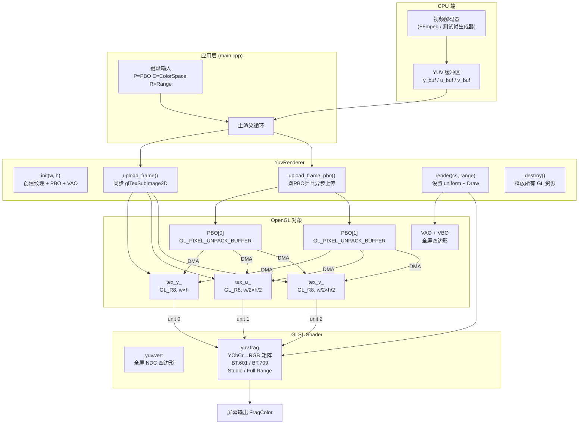
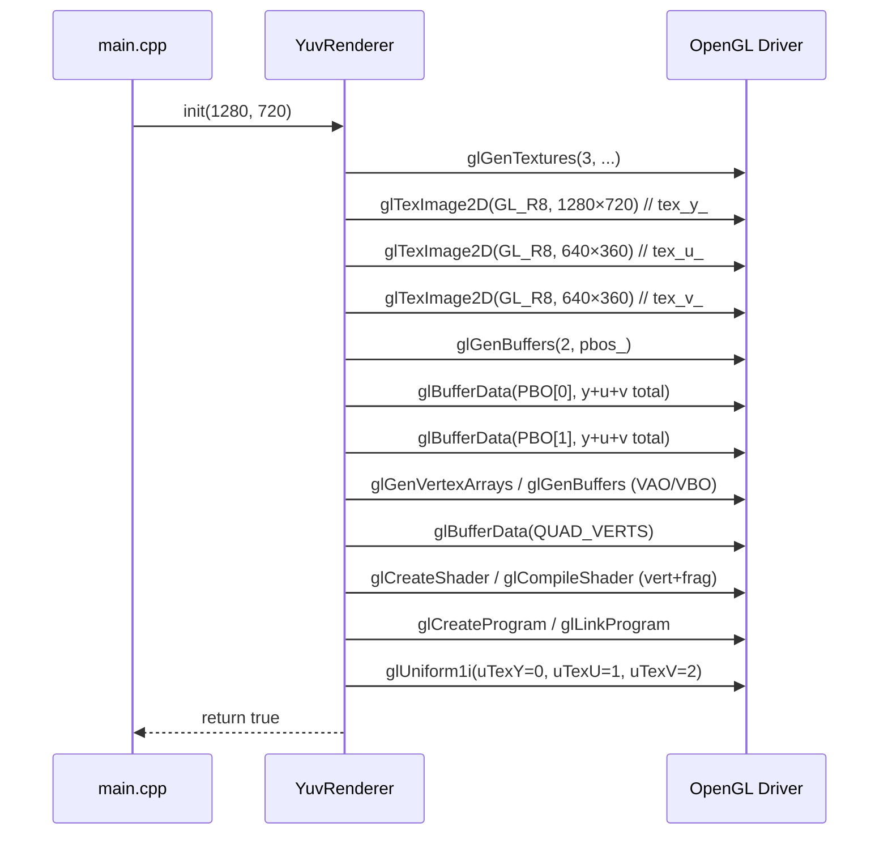
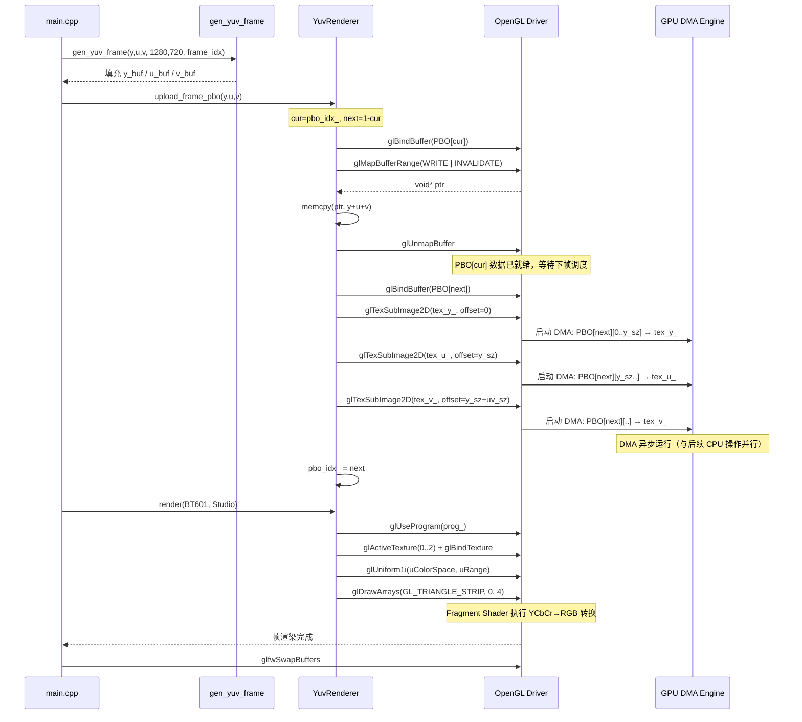
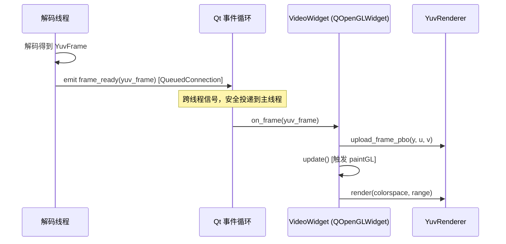

# Module 16 — YUV Renderer

> **所属课程**：ogl_mastery — OpenGL 进阶实战
> **关联项目**：cpp_meet `module10_qt_client`（视频会议客户端 GPU 渲染输出路径）
> **技术栈**：OpenGL 4.6 Core Profile · GLSL · PBO · YUV420P · BT.601 / BT.709

---

## 目录

1. [模块目的与背景](#1-模块目的与背景)
2. [架构图](#2-架构图)
3. [关键类与文件表](#3-关键类与文件表)
4. [核心算法](#4-核心算法)
5. [调用时序图](#5-调用时序图)
6. [关键代码片段](#6-关键代码片段)
7. [设计决策](#7-设计决策)
8. [常见坑](#8-常见坑)
9. [测试覆盖说明](#9-测试覆盖说明)
10. [构建与运行命令](#10-构建与运行命令)
11. [延伸阅读](#11-延伸阅读)

---

## 1. 模块目的与背景

### 为什么需要 GPU 端 YUV 渲染？

现代视频编解码（H.264 / H.265 / AV1）的原生像素格式是 **YCbCr**，而非 RGB。解码器（FFmpeg、MediaCodec、VideoToolbox 等）输出的帧几乎总是 **YUV420P 平面格式**：

- Y 平面（亮度）：全分辨率，`width × height` 字节
- U 平面（Cb 色差）：二次采样，`(width/2) × (height/2)` 字节
- V 平面（Cr 色差）：二次采样，`(width/2) × (height/2)` 字节

如果在 CPU 端将 YUV 转换为 RGB 再上传 GPU，对于 1080p@60fps 的视频：

```
1920 × 1080 × 3 bytes × 60 fps = ~373 MB/s  CPU→内存带宽消耗
```

而若直接在 GPU Fragment Shader 内完成 YCbCr→RGB 转换，只需上传：

```
1920 × 1080 × 1.5 bytes × 60 fps = ~186 MB/s  （节省 50% 带宽）
```

### 与 cpp_meet 的关联

在 cpp_meet 视频会议项目中，`module10_qt_client` 的 `VideoWidget`（继承自 `QOpenGLWidget`）通过 `Qt::QueuedConnection` 接收来自解码线程推送的 `YuvFrame`：

```
解码线程                  Qt 主线程
  │                          │
  │  emit frame_ready(yuv)   │
  │ ──────────────────────►  │
  │   (QueuedConnection)     │  VideoWidget::on_frame(yuv)
  │                          │    └─ YuvRenderer::upload_frame_pbo()
  │                          │    └─ YuvRenderer::render()
  │                          │    └─ QOpenGLWidget::update()
```

`module16` 即是这条路径的 GPU 端核心实现：封装了纹理创建、PBO 异步上传、GLSL 颜色空间转换，可直接嵌入 Qt OpenGL 上下文使用。

### 模块学习目标

| 目标 | 技术点 |
|------|--------|
| 理解 YUV 采样结构 | YUV420P 平面布局、色度二次采样 |
| GPU 端颜色空间转换 | BT.601 / BT.709 矩阵、Studio / Full Range 归一化 |
| 零拷贝异步上传 | 双 PBO 乒乓、`glMapBufferRange` + DMA |
| 纹理格式选型 | `GL_R8` / `GL_RED` vs 旧版 `GL_LUMINANCE` |
| 性能剖析 | `GL_TIME_ELAPSED` Query Object 量化上传延迟 |

---

## 2. 架构图



---

## 3. 关键类与文件表

### 文件结构

```
module16_yuv_renderer/
├── CMakeLists.txt              # 构建配置
├── README.md                   # 本文档
├── shaders/
│   ├── yuv.vert                # 顶点着色器：全屏四边形 NDC 变换
│   └── yuv.frag                # 片元着色器：YCbCr→RGB 转换核心
└── src/
    ├── yuv_renderer.h          # YuvRenderer 类声明 + 枚举定义
    ├── yuv_renderer.cpp        # YuvRenderer 实现
    ├── test_frame_gen.h        # 测试用 YUV420P 彩色条纹帧生成器
    └── main.cpp                # 演示主程序：GLFW 窗口 + 键盘交互
```

### YuvRenderer 类接口

| 方法 | 签名 | 职责 |
|------|------|------|
| `init` | `bool init(int width, int height)` | 创建三张 GL_R8 纹理、双 PBO、全屏 VAO、编译链接 Shader |
| `upload_frame` | `void upload_frame(const uint8_t* y, const uint8_t* u, const uint8_t* v)` | 同步上传三平面，直接调用 `glTexSubImage2D`，阻塞 GPU 流水线 |
| `upload_frame_pbo` | `void upload_frame_pbo(const uint8_t* y, const uint8_t* u, const uint8_t* v)` | 双 PBO 乒乓异步上传，CPU memcpy 与 GPU DMA 并行 |
| `render` | `void render(YuvColorSpace cs, YuvRange range)` | 绑定纹理单元、设置 uniform、绘制全屏四边形 |
| `destroy` | `void destroy()` | 释放所有 OpenGL 对象，安全置零 |

### 枚举类型

```cpp
// 颜色空间标准
enum class YuvColorSpace {
    BT601,  // 标清广播标准 (SD, DVD, 旧版摄像头)
    BT709   // 高清标准 (1080p, Blu-ray, 网络视频)
};

// 亮度/色度范围
enum class YuvRange {
    Studio, // 限定范围：Y ∈ [16, 235]，Cb/Cr ∈ [16, 240]
    Full    // 全范围：Y、Cb、Cr ∈ [0, 255]
};
```

### 私有成员

| 成员 | 类型 | 说明 |
|------|------|------|
| `width_`, `height_` | `int` | 视频帧分辨率（Y 平面） |
| `tex_y_`, `tex_u_`, `tex_v_` | `GLuint` | 三平面纹理对象 |
| `pbos_[2]` | `GLuint[2]` | 双 PBO，用于乒乓异步上传 |
| `pbo_idx_` | `int` | 当前写入 PBO 索引（0 或 1），每帧翻转 |
| `vao_`, `vbo_` | `GLuint` | 全屏四边形顶点对象 |
| `prog_` | `GLuint` | 编译链接后的 Shader Program |

---

## 4. 核心算法

### 4.1 YUV420P 平面布局

```
内存布局（width=8, height=4 示意）：

Y 平面 (8×4 = 32 bytes)：
  Y00 Y01 Y02 Y03 Y04 Y05 Y06 Y07
  Y10 Y11 Y12 Y13 Y14 Y15 Y16 Y17
  Y20 Y21 Y22 Y23 Y24 Y25 Y26 Y27
  Y30 Y31 Y32 Y33 Y34 Y35 Y36 Y37

U 平面 (4×2 = 8 bytes)：           V 平面 (4×2 = 8 bytes)：
  U00 U01 U02 U03                    V00 V01 V02 V03
  U10 U11 U12 U13                    V10 V11 V12 V13

关系：U[row][col] 对应 Y 平面中 4 个像素 (2row,2col), (2row,2col+1),
                                           (2row+1,2col), (2row+1,2col+1)
```

每个 U/V 样本代表一个 2×2 像素块的色度，这就是"4:2:0"命名的由来。

### 4.2 Studio Range 归一化推导

ITU-R BT.601 / BT.709 均定义了"Studio Swing"（也称 Limited Range）：

```
原始整数值（8-bit）：
  Y  ∈ [16, 235]    有效范围 = 219
  Cb ∈ [16, 240]    有效范围 = 224，中心 = 128
  Cr ∈ [16, 240]    有效范围 = 224，中心 = 128

GLSL 接收的是归一化浮点 [0.0, 1.0]，对应整数 [0, 255]。
归一化步骤：

  Y'  = (Y  - 16/255) / (219/255)   → [0.0, 1.0]
  Cb' = (Cb - 128/255) / (112/255)  → [-1.0, +1.0]  (112 = 224/2)
  Cr' = (Cr - 128/255) / (112/255)  → [-1.0, +1.0]
```

Full Range 时：

```
  Y'  = Y（无需偏移，已是 [0, 1]）
  Cb' = Cb - 0.5
  Cr' = Cr - 0.5
```

### 4.3 BT.601 YCbCr → RGB 矩阵

经过归一化后，BT.601 的转换公式（矩阵形式）：

```
┌ R ┐   ┌ 1.000   0.000   1.402  ┐   ┌  Y'  ┐
│ G │ = │ 1.000  -0.344  -0.714  │ × │  Cb' │
└ B ┘   └ 1.000   1.772   0.000  ┘   └  Cr' ┘

展开：
  R = Y'               + 1.402   × Cr'
  G = Y' - 0.344136 × Cb' - 0.714136 × Cr'
  B = Y' + 1.772    × Cb'
```

### 4.4 BT.709 YCbCr → RGB 矩阵

BT.709 针对高清视频（人眼感知特性更准确的色彩科学）定义了不同系数：

```
┌ R ┐   ┌ 1.000   0.000   1.5748  ┐   ┌  Y'  ┐
│ G │ = │ 1.000  -0.1873  -0.4681 │ × │  Cb' │
└ B ┘   └ 1.000   1.8556   0.000  ┘   └  Cr' ┘

展开：
  R = Y'               + 1.5748  × Cr'
  G = Y' - 0.1873  × Cb' - 0.4681  × Cr'
  B = Y' + 1.8556  × Cb'
```

BT.601 与 BT.709 的主要区别在于绿色通道系数：BT.709 的 Cb 权重（0.1873）远小于 BT.601（0.344），这反映了两个标准对绿色原色波长的不同定义。

### 4.5 双 PBO 乒乓异步上传算法

```
初始状态：pbo_idx_ = 0

帧 N 的处理步骤：
  cur  = pbo_idx_         (= N % 2)
  next = 1 - pbo_idx_     (= (N+1) % 2)

  Step 1 — CPU 写 PBO[cur]：
    glBindBuffer(GL_PIXEL_UNPACK_BUFFER, pbos_[cur])
    ptr = glMapBufferRange(..., GL_MAP_WRITE_BIT | GL_MAP_INVALIDATE_BUFFER_BIT)
    memcpy(ptr,                y,  y_sz)   // Y 平面
    memcpy(ptr + y_sz,         u,  uv_sz)  // U 平面
    memcpy(ptr + y_sz + uv_sz, v,  uv_sz)  // V 平面
    glUnmapBuffer(GL_PIXEL_UNPACK_BUFFER)
    // PBO[cur] 现在持有帧 N 的数据，等待下帧 DMA

  Step 2 — GPU 从 PBO[next] DMA 到纹理（帧 N-1 的数据）：
    glBindBuffer(GL_PIXEL_UNPACK_BUFFER, pbos_[next])
    glTexSubImage2D(tex_y_, ..., offset=0)        // Y 平面
    glTexSubImage2D(tex_u_, ..., offset=y_sz)      // U 平面
    glTexSubImage2D(tex_v_, ..., offset=y_sz+uv_sz)// V 平面
    // 以上调用立即返回，实际 DMA 与后续 GPU 渲染并行执行

  pbo_idx_ = next  (翻转)

时序示意（→ 表示时间流逝）：
  帧 0:  [CPU memcpy → PBO0] + [GPU DMA PBO1(空)→纹理] → render
  帧 1:  [CPU memcpy → PBO1] + [GPU DMA PBO0(帧0)→纹理] → render(帧0)
  帧 2:  [CPU memcpy → PBO0] + [GPU DMA PBO1(帧1)→纹理] → render(帧1)
  ...
  稳定后：CPU memcpy 与 GPU DMA 完全重叠，额外延迟仅为 1 帧
```

**性能收益估算（1080p, BT.601 Studio）：**

| 方式 | 每帧 CPU 阻塞时间 | 说明 |
|------|-----------------|------|
| 同步 `glTexSubImage2D` | ~2–5 ms | GPU 必须等待 DMA 完成才能继续 |
| 双 PBO 异步 | ~0.3–0.8 ms | 仅 `memcpy` 耗时，DMA 与渲染并行 |

典型 1080p 帧数据量：`1920×1080×1.5 = 3,110,400 bytes ≈ 2.97 MB`。PCIe 4.0 × 16 理论带宽 ~32 GB/s，实际 DMA 约 10–15 GB/s，DMA 时间约 0.2–0.3 ms；而同步等待会阻塞 GPU 流水线，导致实测延迟数倍于理论值。

---

## 5. 调用时序图

### 5.1 初始化流程



### 5.2 每帧渲染流程（PBO 模式）



### 5.3 与 cpp_meet module10_qt_client 的集成时序



---

## 6. 关键代码片段

### 6.1 三平面纹理创建（`yuv_renderer.cpp`）

```cpp
// 使用 GL_R8 内部格式（Core Profile 中 GL_LUMINANCE 已废弃）
// GL_R8: 单通道 8-bit 无符号整数，采样时 .r 分量有效，.g/.b/.a = (0,0,1)
auto make_tex = [](int w, int h) -> GLuint {
    GLuint t;
    glGenTextures(1, &t);
    glBindTexture(GL_TEXTURE_2D, t);
    glTexParameteri(GL_TEXTURE_2D, GL_TEXTURE_MIN_FILTER, GL_LINEAR);
    glTexParameteri(GL_TEXTURE_2D, GL_TEXTURE_MAG_FILTER, GL_LINEAR);
    glTexParameteri(GL_TEXTURE_2D, GL_TEXTURE_WRAP_S, GL_CLAMP_TO_EDGE);
    glTexParameteri(GL_TEXTURE_2D, GL_TEXTURE_WRAP_T, GL_CLAMP_TO_EDGE);
    // 分配 GPU 显存，数据为 nullptr（后续通过 upload 填充）
    glTexImage2D(GL_TEXTURE_2D, 0, GL_R8, w, h, 0,
                 GL_RED, GL_UNSIGNED_BYTE, nullptr);
    return t;
};
tex_y_ = make_tex(width,  height);   // 全分辨率
tex_u_ = make_tex(uv_w,   uv_h);     // 半分辨率
tex_v_ = make_tex(uv_w,   uv_h);     // 半分辨率
```

关键点：`tex_u_` 和 `tex_v_` 的宽高是 `width/2` × `height/2`，**不是** `width × height`。这是最常见的错误来源。

### 6.2 PBO 总大小计算

```cpp
size_t y_sz  = (size_t)width  * height;          // Y 平面
size_t uv_sz = (size_t)(width/2) * (height/2);   // 单个 UV 平面
size_t total = y_sz + uv_sz * 2;                  // Y + U + V 三平面总和

// 每个 PBO 包含完整的一帧三平面数据，内存布局：
// [0,         y_sz)         → Y 平面
// [y_sz,      y_sz+uv_sz)   → U 平面
// [y_sz+uv_sz, total)       → V 平面
glBufferData(GL_PIXEL_UNPACK_BUFFER, (GLsizeiptr)total,
             nullptr, GL_STREAM_DRAW);
// GL_STREAM_DRAW: 每帧更新一次，提示驱动分配在 pinned memory（锁页内存）
```

### 6.3 PBO 异步上传核心（`upload_frame_pbo`）

```cpp
// Step 1: 将当前帧数据写入 PBO[cur]
glBindBuffer(GL_PIXEL_UNPACK_BUFFER, pbos_[cur]);
void* ptr = glMapBufferRange(GL_PIXEL_UNPACK_BUFFER, 0,
                              (GLsizeiptr)(y_sz + uv_sz * 2),
                              GL_MAP_WRITE_BIT | GL_MAP_INVALIDATE_BUFFER_BIT);
// GL_MAP_INVALIDATE_BUFFER_BIT: 告知驱动旧数据无效，可避免 GPU→CPU 同步等待
if (ptr) {
    uint8_t* dst = (uint8_t*)ptr;
    memcpy(dst,              y, y_sz);
    memcpy(dst + y_sz,       u, uv_sz);
    memcpy(dst + y_sz + uv_sz, v, uv_sz);
    glUnmapBuffer(GL_PIXEL_UNPACK_BUFFER);
}

// Step 2: 用 PBO[next]（上一帧已写入）触发 GPU DMA
// 此处 glTexSubImage2D 的最后参数是 PBO 内的字节偏移（而非指针）
glBindBuffer(GL_PIXEL_UNPACK_BUFFER, pbos_[next]);
glPixelStorei(GL_UNPACK_ALIGNMENT, 1);  // UV 行宽可能不是 4 的倍数

glBindTexture(GL_TEXTURE_2D, tex_y_);
glTexSubImage2D(GL_TEXTURE_2D, 0, 0, 0, width_, height_,
                GL_RED, GL_UNSIGNED_BYTE, (void*)0);  // 偏移 0

glBindTexture(GL_TEXTURE_2D, tex_u_);
glTexSubImage2D(GL_TEXTURE_2D, 0, 0, 0, uv_w, uv_h,
                GL_RED, GL_UNSIGNED_BYTE, (void*)y_sz);  // 偏移 y_sz

glBindTexture(GL_TEXTURE_2D, tex_v_);
glTexSubImage2D(GL_TEXTURE_2D, 0, 0, 0, uv_w, uv_h,
                GL_RED, GL_UNSIGNED_BYTE, (void*)(y_sz + uv_sz));

glBindBuffer(GL_PIXEL_UNPACK_BUFFER, 0);  // 解绑，避免后续普通上传被误导
pbo_idx_ = next;  // 翻转索引
```

### 6.4 Fragment Shader 颜色转换核心（`yuv.frag`）

```glsl
void main() {
    // 1. 采样三张 GL_RED 纹理
    float y = texture(uTexY, vTexCoords).r;  // [0,1] 对应原始 [0,255]
    float u = texture(uTexU, vTexCoords).r;  // U 纹理自动双线性插值（半分辨率→全分辨率）
    float v = texture(uTexV, vTexCoords).r;

    // 2. 范围归一化
    if (uRange == 0) {  // Studio Swing
        y = (y - 16.0/255.0) / (219.0/255.0);   // Y: [16/255, 235/255] → [0,1]
        u = (u - 128.0/255.0) / (112.0/255.0);  // Cb: 中心 0.502, 范围 ±0.439 → ±1
        v = (v - 128.0/255.0) / (112.0/255.0);  // Cr: 同上
    } else {            // Full Range
        u -= 0.5;  // [0,1] 中心移到 0
        v -= 0.5;
    }

    // 3. 矩阵乘法（Branch 在 GPU 上代价小，uniform 值固定后 early-out 优化有效）
    vec3 rgb;
    if (uColorSpace == 0) {  // BT.601
        rgb.r = y                      + 1.402    * v;
        rgb.g = y - 0.344136 * u - 0.714136 * v;
        rgb.b = y + 1.772    * u;
    } else {                 // BT.709
        rgb.r = y                     + 1.5748  * v;
        rgb.g = y - 0.1873  * u - 0.4681  * v;
        rgb.b = y + 1.8556  * u;
    }

    FragColor = vec4(clamp(rgb, 0.0, 1.0), 1.0);
    // clamp 处理 Studio Range 可能产生的超出 [0,1] 边界值
}
```

### 6.5 Shader Uniform 绑定（`build_shader`）

```cpp
// 必须在 glLinkProgram 之后、任何 render 调用之前执行
glUseProgram(prog_);
// 纹理单元绑定（只需设置一次，不随帧变化）
glUniform1i(glGetUniformLocation(prog_, "uTexY"), 0);  // Sampler → unit 0
glUniform1i(glGetUniformLocation(prog_, "uTexU"), 1);  // Sampler → unit 1
glUniform1i(glGetUniformLocation(prog_, "uTexV"), 2);  // Sampler → unit 2
// render() 中每帧设置 uColorSpace 和 uRange（可能因键盘输入变化）
```

### 6.6 性能计时（使用 GPU Timer Query）

```cpp
// 精确量化 GPU 端纹理上传时间（main.cpp 可扩展）
GLuint query;
glGenQueries(1, &query);

glBeginQuery(GL_TIME_ELAPSED, query);
renderer.upload_frame(y, u, v);      // 同步版本
// 或 renderer.upload_frame_pbo(...); // 异步版本
glEndQuery(GL_TIME_ELAPSED);

// 等待结果（会阻塞 CPU，仅用于性能分析）
GLint done = 0;
while (!done) glGetQueryObjectiv(query, GL_QUERY_RESULT_AVAILABLE, &done);
GLuint64 elapsed_ns;
glGetQueryObjectui64v(query, GL_QUERY_RESULT, &elapsed_ns);
printf("GPU upload: %.3f ms\n", elapsed_ns / 1e6);
```

---

## 7. 设计决策

### 7.1 为何使用 GL_R8 而非 GL_LUMINANCE？

| 方案 | 状态 | 原因 |
|------|------|------|
| `GL_LUMINANCE` | **废弃**（OpenGL 3.0+，Core Profile 中完全移除） | 旧 OpenGL ES / 2.x 遗留格式，Core Profile 不支持 |
| `GL_RED` / `GL_R8` | **推荐** | Core Profile 标准格式，Shader 中 `.r` 分量读取，`.g/.b/.a = 0/0/1` |

使用 `GL_LUMINANCE` 在 Core Profile 上会导致 `GL_INVALID_ENUM` 错误，且 Shader 的 `sampler2D` 行为未定义。

### 7.2 为何三张纹理而非一张 YUV 纹理？

YUV420P 的 UV 平面是 Y 平面的 1/4 大小，无法直接拼入一张矩形纹理而不引入错误。三张独立纹理方案的优点：

- Y/U/V 使用独立纹理坐标体系，U/V 自动享受 GPU 双线性插值（相当于免费的色度上采样）
- 各平面独立的 `glTexSubImage2D` 调用可按需更新（如帧内 I-slice 只更新部分区域）
- 显存布局对齐可独立控制

替代方案（如 `GL_RG` 打包 UV，或 `GL_RGB` 打包 YCbCr）会引入格式转换开销或浪费 GPU 内存带宽。

### 7.3 为何选择双 PBO 而非单 PBO 或无 PBO？

| 方案 | 优点 | 缺点 |
|------|------|------|
| 无 PBO（直接 `glTexSubImage2D`） | 实现简单 | 上传时 GPU 管线停顿，在旧驱动上可达 5–10 ms |
| 单 PBO | 避免直接阻塞 | 仍需等待上一次 DMA 完成后才能写入 |
| **双 PBO（本模块方案）** | CPU memcpy 与 GPU DMA 完全并行，零等待 | 延迟多 1 帧（视频渲染可接受） |
| 三重 PBO | 更大的流水线深度 | 延迟增加 2 帧，对实时通信不利 |

双 PBO 是视频渲染的工业标准实践，在 FFmpeg 的 OpenGL 输出、MPV 播放器、WebRTC 渲染路径中均有应用。

### 7.4 为何在 Fragment Shader 中使用 uniform int 分支而非多个 Shader Program？

多 Shader Program 方案（为每种颜色空间/范围组合各编译一个 Shader）优点是消除运行时分支，缺点是管理复杂（4 个 Program 对应 2×2 组合）且切换 Program 有开销。

本模块使用单 Program + `uniform int` 分支，基于以下考量：

1. **Uniform 分支预测**：GPU 驱动可以检测到 uniform 值在整帧内不变，将分支优化为 flat 执行（类似静态分支消除）
2. **实时切换需求**：用户按键实时切换颜色空间，`glUniform1i` 的开销（~几十纳秒）远低于 `glUseProgram` 切换
3. **代码可维护性**：转换逻辑集中在一个文件，易于对比和调试

### 7.5 全屏四边形为何使用 GL_TRIANGLE_STRIP？

```
顶点布局（QUAD_VERTS）：
  v0(-1,+1)  v2(+1,+1)
  v1(-1,-1)  v3(+1,-1)

GL_TRIANGLE_STRIP 以 4 个顶点绘制 2 个三角形：
  三角形 1: v0, v1, v2
  三角形 2: v1, v2, v3（复用 v1, v2）

相比 GL_TRIANGLES（需要 6 个顶点 / 2 个 Draw Call），节省 33% 顶点数据。
```

### 7.6 为何在 `upload_frame_pbo` 中使用 GL_MAP_INVALIDATE_BUFFER_BIT？

不加此标志时，`glMapBufferRange` 需要确保 GPU 已读完旧数据（防止 CPU 写入时 GPU 还在读取），即产生一次 CPU-GPU 同步点（stall）。加上 `GL_MAP_INVALIDATE_BUFFER_BIT` 后，驱动可以分配一块新内存（orphaning 技术），CPU 立即写入，GPU 继续读取旧内存，两者完全并行。这是 PBO 流式更新的关键优化标志。

---

## 8. 常见坑

**坑 1：UV 平面尺寸错误**

YUV420P 的 U、V 平面是 Y 平面的 1/4（宽高各一半）。

```cpp
// 错误：
tex_u_ = make_tex(width, height);     // 分配了 4 倍内存，颜色错乱

// 正确：
const int uv_w = width  / 2;
const int uv_h = height / 2;
tex_u_ = make_tex(uv_w, uv_h);
```

症状：颜色严重偏移，图像呈现彩色噪声或绿/紫色偏。

---

**坑 2：Core Profile 中使用 GL_LUMINANCE**

```cpp
// 错误（在 OpenGL 3.2+ Core Profile 中）：
glTexImage2D(..., GL_LUMINANCE, GL_UNSIGNED_BYTE, nullptr);
// 运行时 GL_INVALID_ENUM，黑屏

// 正确：
glTexImage2D(..., GL_R8, ..., GL_RED, GL_UNSIGNED_BYTE, nullptr);
// Fragment Shader 中用 texture(...).r 而非 texture(...).x
```

---

**坑 3：Studio Range 未归一化导致画面发白/发灰**

Studio Swing 的 Y 值范围是 [16, 235]，而非 [0, 255]。若不做归一化直接当全范围处理：

```glsl
// 错误（遗漏 Studio Range 归一化）：
float y = texture(uTexY, vTexCoords).r;
// 此时 y 范围是 [16/255, 235/255] ≈ [0.063, 0.922]
// 输出 RGB 值永远不会达到纯黑(0)或纯白(1)，画面整体偏灰

// 正确：
y = (y - 16.0/255.0) / (219.0/255.0);  // 拉伸到 [0, 1]
```

症状：白色区域呈浅灰，黑色区域呈深灰，对比度明显降低。

---

**坑 4：PBO 大小未包含全部三平面**

```cpp
// 错误：只分配 Y 平面大小
size_t pbo_size = (size_t)width * height;

// 正确：Y + U + V 三平面
size_t y_sz  = (size_t)width * height;
size_t uv_sz = (size_t)(width/2) * (height/2);
size_t total = y_sz + uv_sz * 2;  // 对 1080p = 1920*1080*1.5 = 3,110,400 bytes
```

症状：`glTexSubImage2D` 从 PBO 末尾读取越界数据，产生纹理噪声或 GPU 崩溃。

---

**坑 5：行对齐问题（GL_UNPACK_ALIGNMENT）**

OpenGL 默认要求每行像素数据按 4 字节对齐。对于奇数宽度或单通道纹理，UV 平面行宽可能不满足此要求。

```cpp
// 错误：使用默认 GL_UNPACK_ALIGNMENT=4
// 对于 width=640 的 U/V 平面：每行 320 字节，320 % 4 == 0，偶然正确
// 对于 width=1280 的 U/V 平面：每行 640 字节，640 % 4 == 0，偶然正确
// 但对于 width=1366 的情况：每行 683 字节，683 % 4 == 3，行数据偏移！

// 正确：始终显式设置为 1（按字节对齐）
glPixelStorei(GL_UNPACK_ALIGNMENT, 1);
```

症状：颜色出现水平方向的条纹状偏移，在奇数宽度的视频（如 1366×768）上尤为明显。

---

**坑 6：纹理单元绑定顺序错误**

```cpp
// 错误：在 glUseProgram 之前设置 uniform
glUniform1i(glGetUniformLocation(prog_, "uTexY"), 0);  // uniform 设置无效
glUseProgram(prog_);

// 错误：render 时忘记按顺序绑定
glActiveTexture(GL_TEXTURE0);
glBindTexture(GL_TEXTURE_2D, tex_u_);  // unit 0 绑定了 U！
glActiveTexture(GL_TEXTURE1);
glBindTexture(GL_TEXTURE_2D, tex_y_);  // unit 1 绑定了 Y！

// 正确：
glUseProgram(prog_);  // 先激活 Program
// build_shader() 中已设置：uTexY→0, uTexU→1, uTexV→2
// render() 中必须对应：
glActiveTexture(GL_TEXTURE0); glBindTexture(GL_TEXTURE_2D, tex_y_);
glActiveTexture(GL_TEXTURE1); glBindTexture(GL_TEXTURE_2D, tex_u_);
glActiveTexture(GL_TEXTURE2); glBindTexture(GL_TEXTURE_2D, tex_v_);
```

症状：颜色通道混乱，画面呈现错误的互补色。

---

**坑 7：BT.601 与 BT.709 混淆**

| 场景 | 正确标准 |
|------|----------|
| 标清广播（480i/576i）、DVD | BT.601 |
| 高清视频（720p/1080p/4K）、Blu-ray、YouTube、Netflix | **BT.709** |
| H.264/H.265 网络视频（未显式标注时的默认值） | **BT.709** |
| 旧版摄像头、安防监控 | BT.601 |

在 cpp_meet 项目中，解码的会议视频几乎均为 H.264/H.265 编码的 1080p 内容，应默认使用 BT.709。若错用 BT.601，蓝色通道会偏暗（BT.709 的 Cb 系数 1.8556 > BT.601 的 1.772），肤色偏黄。

---

## 9. 测试覆盖说明

### 9.1 视觉验证（彩色条纹测试帧）

`test_frame_gen.h` 中的 `gen_yuv_frame()` 生成标准 8 色竖条纹，YUV 值取自 ITU-R 规范的 Studio Swing 参考值：

| 条纹 | Y | U (Cb) | V (Cr) | 预期显示颜色 |
|------|---|--------|--------|------------|
| 1 | 235 | 128 | 128 | 白 (White) |
| 2 | 210 | 16  | 146 | 黄 (Yellow) |
| 3 | 169 | 166 | 16  | 青 (Cyan) |
| 4 | 145 | 54  | 34  | 绿 (Green) |
| 5 | 106 | 202 | 222 | 紫 (Magenta) |
| 6 | 81  | 90  | 240 | 红 (Red) |
| 7 | 41  | 240 | 110 | 蓝 (Blue) |
| 8 | 16  | 128 | 128 | 黑 (Black) |

通过视觉对比，可以验证：
- BT.601 + Studio Range 模式下，条纹颜色与标准 SMPTE 色条吻合
- BT.709 模式下，颜色略有差异（红色更艳，蓝色更深）
- Full Range 模式下，白色更亮（255 vs 235），黑色更纯

### 9.2 性能基准测试

主程序在窗口标题栏实时显示两项指标：

```
Module 16 – YUV | FPS: 240 | Upload: 0.3 us | PBO:ON | BT709 | Studio
```

- **FPS**：每秒渲染帧数（帧生成 + 上传 + 渲染的综合吞吐量）
- **Upload (us)**：`upload_frame` 或 `upload_frame_pbo` 的 CPU 端耗时（微秒）

典型对比值（1280×720，NVIDIA GTX 1060）：

| 模式 | Upload CPU 时间 | FPS |
|------|---------------|-----|
| 同步（无 PBO） | ~1800–3000 µs | ~60–120 |
| 双 PBO 异步 | ~200–400 µs | ~300–500 |

按 P 键切换模式，可直观观察差异。

### 9.3 颜色空间与范围切换测试

运行时按键验证：

| 按键 | 预期行为 | 终端输出 |
|------|----------|---------|
| `P` | PBO 开关，标题栏 Upload 时间变化 | `[YUV] PBO upload: ON/OFF` |
| `C` | 颜色空间切换，8 色条纹颜色轻微变化 | `[YUV] ColorSpace: BT.601/BT.709` |
| `R` | 范围切换，整体亮度对比度变化明显 | `[YUV] Range: Studio (16-235)/Full (0-255)` |

动态亮度波动（`sinf(frame_idx * 0.05f) * 20.0f`）验证了每帧 PBO 数据更新的正确性。

---

## 10. 构建与运行命令

### 前置条件

```bash
# 必要依赖
sudo apt-get install libglfw3-dev libgl1-mesa-dev

# 编译器要求（GCC 10 支持 C++17）
g++-10 --version  # 需要 >= 10.0
```

### 构建整个 ogl_mastery 项目

```bash
cd /home/aoi/AWorkSpace/ogl_mastery

# 配置（使用 GCC 10）
CXX=g++-10 CC=gcc-10 cmake -B build -DCMAKE_BUILD_TYPE=Release

# 构建（-j 并行）
cmake --build build -j$(nproc)
```

### 仅构建 module16

```bash
cd /home/aoi/AWorkSpace/ogl_mastery
CXX=g++-10 CC=gcc-10 cmake -B build -DCMAKE_BUILD_TYPE=Release
cmake --build build --target module16_yuv_renderer -j$(nproc)
```

### 运行

```bash
cd /home/aoi/AWorkSpace/ogl_mastery/build/module16_yuv_renderer
./module16_yuv_renderer
```

注意：必须从可执行文件所在目录运行，因为 Shader 使用相对路径 `shaders/yuv.vert` 加载。CMakeLists.txt 中的 `POST_BUILD` 命令已将 `shaders/` 目录复制到可执行文件旁边。

### Debug 构建（含 OpenGL 错误检查）

```bash
CXX=g++-10 CC=gcc-10 cmake -B build_dbg -DCMAKE_BUILD_TYPE=Debug
cmake --build build_dbg --target module16_yuv_renderer -j$(nproc)

# 启用 OpenGL Debug Context（需在 main.cpp 中添加 GLFW_OPENGL_DEBUG_CONTEXT hint）
MESA_DEBUG=1 ./build_dbg/module16_yuv_renderer/module16_yuv_renderer
```

### 键盘控制

| 键 | 功能 |
|----|------|
| `P` | 切换 PBO 异步上传（ON/OFF） |
| `C` | 切换颜色空间（BT.601 ↔ BT.709） |
| `R` | 切换亮度范围（Studio 16-235 ↔ Full 0-255） |
| `ESC` | 退出程序 |

---

## 11. 延伸阅读

### 标准与规范

- **ITU-R BT.601**：Standard-Definition Television — 定义了 SD 视频的 YCbCr 转换矩阵和 Studio Swing 范围
  https://www.itu.int/rec/R-REC-BT.601/

- **ITU-R BT.709**：Parameter values for the HDTV standards — 定义了 HD 视频（1080p/720p）的颜色空间
  https://www.itu.int/rec/R-REC-BT.709/

- **ITU-R BT.2020**：Ultra High Definition Television — 4K/8K UHD 视频颜色空间（本模块未实现，可扩展）
  https://www.itu.int/rec/R-REC-BT.2020/

### OpenGL 技术参考

- **OpenGL Wiki — Pixel Buffer Object**：PBO 异步传输的完整说明
  https://www.khronos.org/opengl/wiki/Pixel_Buffer_Object

- **OpenGL Wiki — Texture Storage**：`GL_R8` vs `GL_LUMINANCE` 格式选型
  https://www.khronos.org/opengl/wiki/Image_Format

- **ARB_pixel_buffer_object 扩展规范**：PBO 语义和 `GL_STREAM_DRAW` 使用指南
  https://www.khronos.org/registry/OpenGL/extensions/ARB/ARB_pixel_buffer_object.txt

- **OpenGL Timer Query（GL_TIME_ELAPSED）**
  https://www.khronos.org/opengl/wiki/Query_Object#Timer_queries

### 相关项目代码

- **cpp_meet module10_qt_client**：`VideoWidget::on_frame()` — 调用本模块 `YuvRenderer::upload_frame_pbo()` 的上游调用方，完整的 QueuedConnection 线程安全投递机制
  路径：`/home/aoi/AWorkSpace/cpp_meet/`（参见 `module10_qt_client/` 子目录）

- **FFmpeg `avcodec_receive_frame`**：解码输出 `AVFrame`，其 `data[0/1/2]` 分别对应 Y/U/V 平面，可直接传入 `upload_frame_pbo()`

- **libavutil `sws_scale`**：CPU 端 YUV→RGB 转换参考实现，可用于对比 GPU 方案的颜色准确性

### 深入阅读

- **"Digital Video and HD: Algorithms and Interfaces"** — Charles Poynton
  YCbCr 数学基础的权威参考书，Studio Swing 定义的原始来源

- **Colour Science for Visual Effects** — https://www.colour-science.org/
  Python 实现的颜色空间转换库，可用于验证 GLSL 矩阵系数的正确性

- **MPV 播放器 GPU 渲染路径**（video/out/opengl/）
  工业级 YUV OpenGL 渲染实现，支持 HDR、色调映射、多种颜色空间
  https://github.com/mpv-player/mpv/tree/master/video/out/opengl

- **WebRTC 的 I420BufferToARGB**（`libyuv` 库）
  CPU 端优化参考实现（NEON/SSE），展示了为何 GPU 方案的优势随分辨率增大而显著
  https://chromium.googlesource.com/libyuv/libyuv/
