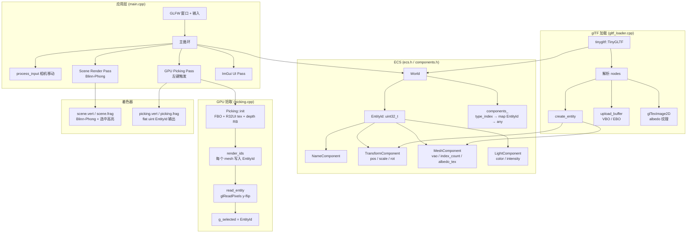
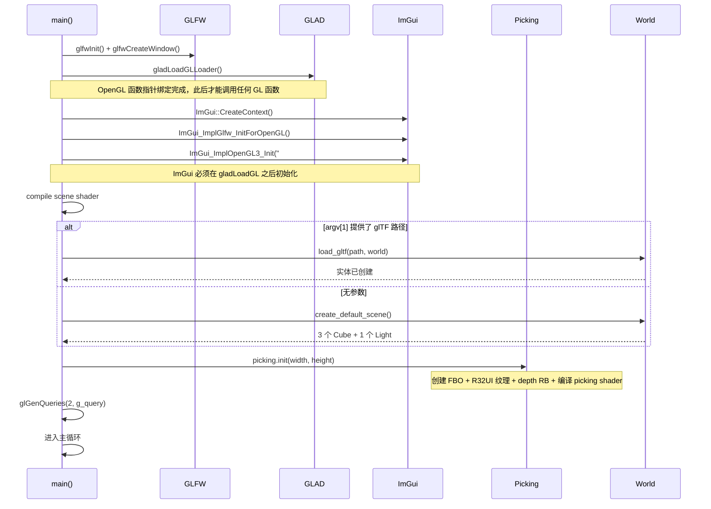
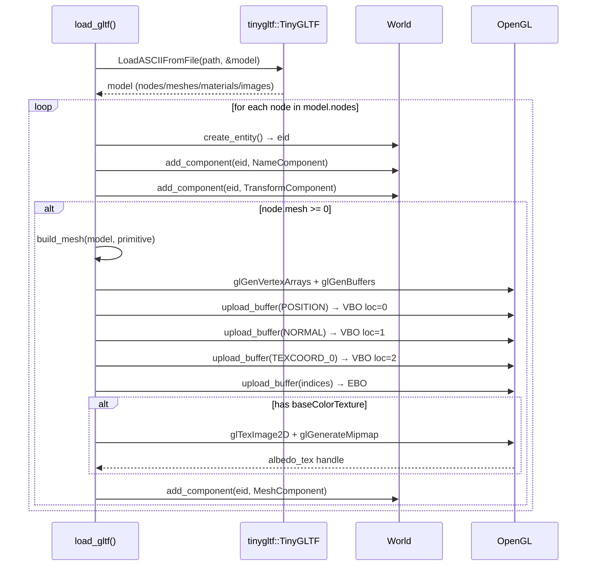

# Module 17 — Scene Editor（场景编辑器）

> **课程系列**：ogl_mastery · OpenGL 进阶实战
> **依赖模块**：module11_framebuffer（FBO）、module08_lighting（Blinn-Phong）
> **核心技术**：ECS 架构、glTF 2.0 加载、GPU 拾取、ImGui 交互、GPU Timer Query

---

## 1. 模块目的与背景

### 1.1 为什么需要场景编辑器

现代游戏引擎与渲染工具（Unity、Unreal、Blender）的核心都是一个**场景编辑器**。它解决了以下问题：

- **场景管理**：场景中存在数百个对象，如何高效组织和查询？
- **运行时交互**：如何点击屏幕上的物体并实时修改其属性？
- **资产加载**：如何将 Blender/Maya 导出的 3D 模型导入引擎？
- **性能监控**：如何实时显示 GPU 每个 pass 的耗时？

本模块以最小化实现为目标，将以上四个问题逐一解决，最终得到一个可以：
- 加载 `.gltf` / `.glb` 文件
- 在 ImGui 面板中浏览场景图、修改实体属性
- 左键点击 3D 视口选中物体（GPU 拾取）
- 显示场景渲染和拾取 pass 耗时

的迷你场景编辑器原型。

### 1.2 技术选型一览

| 技术 | 说明 |
|------|------|
| ECS（Entity Component System） | 解耦数据与逻辑，便于扩展 |
| tinygltf | 轻量级 glTF 2.0 解析库（header-only + stb） |
| ImGui | 即时模式 GUI，直接嵌入 OpenGL 主循环 |
| GPU Picking | FBO + R32UI 纹理，将选中操作从 CPU 射线检测改为 GPU 逐像素编码 |
| GL_TIME_ELAPSED Query | 精确测量 GPU pass 耗时，非阻塞读取（上一帧结果） |
| Blinn-Phong | 经典实时光照模型，带选中高亮（橙色叠加） |

---

## 2. 架构图



---

## 3. 关键类与文件表

### 3.1 文件结构

```
module17_scene_editor/
├── CMakeLists.txt
├── include/
│   ├── ecs.h              # World 类 + EntityId 定义
│   ├── components.h       # 四种组件结构体
│   ├── gltf_loader.h      # load_gltf() 声明
│   └── picking.h          # Picking 类声明
├── src/
│   ├── main.cpp           # 主循环、ImGui、场景渲染、GPU Query
│   ├── gltf_loader.cpp    # tinygltf 解析 + VAO/纹理上传
│   └── picking.cpp        # FBO 初始化 + ID 渲染 + 像素读取
└── shaders/
    ├── scene.vert          # 顶点着色器（位置/法线/UV 变换）
    ├── scene.frag          # 片段着色器（Blinn-Phong + 高亮）
    ├── picking.vert        # 拾取顶点着色器（仅 MVP 变换）
    └── picking.frag        # 拾取片段着色器（输出 uint EntityId）
```

### 3.2 关键类说明

| 类/结构 | 文件 | 职责 |
|---------|------|------|
| `World` | `ecs.h` | ECS 核心：实体创建/销毁，组件增删查，全类型迭代 |
| `TransformComponent` | `components.h` | TRS 变换（四元数旋转），提供 `matrix()` 方法 |
| `MeshComponent` | `components.h` | VAO 句柄 + 索引数 + albedo 纹理 |
| `LightComponent` | `components.h` | 点光源颜色、强度、方向光标志 |
| `NameComponent` | `components.h` | 实体名称字符串，供 ImGui 场景图显示 |
| `Picking` | `picking.h/cpp` | FBO 管理、ID pass 渲染、像素读取 |
| `load_gltf()` | `gltf_loader.cpp` | 将 glTF 文件解析为 ECS 实体树 |

### 3.3 全局状态（main.cpp）

| 变量 | 类型 | 说明 |
|------|------|------|
| `g_world` | `World` | 全局 ECS 世界，所有实体存于此 |
| `g_selected` | `EntityId` | 当前选中实体（`INVALID_ENTITY = 0` 表示无选中） |
| `g_light_entity` | `EntityId` | 场景主光源实体 ID |
| `g_query[2]` | `GLuint[2]` | GPU Timer Query 对象（0=scene pass, 1=picking pass） |
| `g_scene_ms/g_pick_ms` | `double` | 上一帧各 pass 耗时（毫秒） |

---

## 4. 核心算法

### 4.1 ECS World 设计详解

`World` 类采用**双层嵌套哈希表**实现稀疏组件存储：

```
components_
└── std::unordered_map<std::type_index, ...>   // 外层：按组件类型分桶
      └── std::unordered_map<EntityId, std::any>  // 内层：按实体ID存组件值
```

**核心操作时间复杂度：**

| 操作 | 复杂度 | 说明 |
|------|--------|------|
| `create_entity()` | O(1) | 自增计数器 |
| `add_component<T>()` | O(1) 均摊 | 两次哈希表插入 |
| `get_component<T>()` | O(1) 均摊 | 两次哈希表查找 + any_cast |
| `each<T>(fn)` | O(N_T) | 遍历类型 T 的所有组件 |
| `destroy_entity()` | O(K) | K = 组件类型数，每类型各删一次 |

**设计要点：**
- `std::any` 存储任意类型组件，避免虚函数和类型擦除的额外复杂度
- `entities_` 向量维护有序实体列表，保证 ImGui 场景图顺序稳定
- `next_id_` 从 1 开始，0 保留为 `INVALID_ENTITY`，判空一目了然

### 4.2 glTF 加载算法

```
load_gltf(path, world):
  1. tinygltf::LoadASCIIFromFile (或 LoadBinaryFromFile for .glb)
  2. for each node in model.nodes:
     a. world.create_entity() → eid
     b. 读取 node.name → 添加 NameComponent
     c. 读取 node.translation/scale/rotation → 添加 TransformComponent
        注意：glTF 四元数顺序 [x,y,z,w]，glm 构造顺序 (w,x,y,z)
     d. if node.mesh >= 0:
          for each primitive in mesh.primitives:
            build_mesh(model, prim) → 添加 MeshComponent
            break  // 只取第一个 primitive（简化实现）

build_mesh(model, prim):
  1. glGenVertexArrays → VAO
  2. 绑定 POSITION  (location=0)：upload_buffer → VBO → glVertexAttribPointer
  3. 绑定 NORMAL    (location=1)：upload_buffer → VBO → glVertexAttribPointer
  4. 绑定 TEXCOORD_0(location=2)：upload_buffer → VBO → glVertexAttribPointer
  5. 若有 indices：upload_buffer → EBO，记录 index_count
  6. 若有 material.baseColorTexture：
       读取 model.images[source]
       glTexImage2D + glGenerateMipmap → albedo_tex
  7. 返回 MeshComponent{vao, index_count, albedo_tex}

upload_buffer(model, accessor_idx, target):
  acc  = model.accessors[accessor_idx]
  bv   = model.bufferViews[acc.bufferView]
  ptr  = buf.data + bv.byteOffset + acc.byteOffset  // 注意：两个偏移都要加
  glBufferData(target, bv.byteLength, ptr, GL_STATIC_DRAW)
```

### 4.3 GPU 拾取算法

```
Picking::init(w, h):
  1. 创建 FBO
  2. 颜色附件：GL_R32UI 纹理（每像素存一个 uint32 EntityId）
     - 内部格式：GL_R32UI
     - 上传格式：GL_RED_INTEGER（整数纹理必须用 *_INTEGER 格式）
  3. 深度附件：GL_DEPTH_COMPONENT24 Renderbuffer
  4. 编译 picking.vert + picking.frag

每帧左键点击时：
  Picking::render_ids(world, vp):
    绑定 picking FBO
    glClearBufferuiv(GL_COLOR, 0, &zero)  // 清为 0 (INVALID_ENTITY)
    glClear(GL_DEPTH_BUFFER_BIT)
    for each entity with MeshComponent:
      glUniform1ui(uEntityId, eid)
      glUniformMatrix4fv(uMVP, vp * model_matrix)
      glDrawElements(...)
    解绑 FBO

  Picking::read_entity(x, y):
    绑定 FBO 为 READ_FRAMEBUFFER
    flipped_y = height - 1 - y        // 关键：Y 轴翻转
    glReadPixels(x, flipped_y, 1, 1, GL_RED_INTEGER, GL_UNSIGNED_INT, &id)
    return (EntityId)id
```

### 4.4 GPU Timer Query（非阻塞）

```
初始化：
  glGenQueries(2, g_query)   // 0=scene pass, 1=picking pass

每帧逻辑：
  // 1. 先读取上一帧结果（非阻塞，可能返回 0 如果结果未就绪）
  glGetQueryObjectui64v(g_query[0], GL_QUERY_RESULT_NO_WAIT, &t)
  g_scene_ms = t * 1e-6

  // 2. 开始本帧计时
  glBeginQuery(GL_TIME_ELAPSED, g_query[0])
    // ... 执行 scene render pass ...
  glEndQuery(GL_TIME_ELAPSED)

  // 3. picking pass 同理，使用 g_query[1]
```

**关键**：`GL_QUERY_RESULT_NO_WAIT` 不阻塞 CPU，但读取的是上一帧（甚至更早）的结果，
存在 1 帧延迟。若使用 `GL_QUERY_RESULT`，会强制 CPU 等待 GPU 完成，造成管线停顿。

### 4.5 TransformComponent::matrix() 变换合成

```
// 实际使用四元数旋转（不是欧拉角分解）
glm::mat4 TransformComponent::matrix():
  m = identity
  m = translate(m, pos)          // 平移
  m = m * mat4_cast(rot)         // 四元数转旋转矩阵
  m = scale(m, scale)            // 缩放
  return m
  // 变换顺序（从右到左应用）：先缩放 → 再旋转 → 最后平移
  // 等价于 TRS 矩阵：T * R * S
```

---

## 5. 调用时序图

### 5.1 启动流程



### 5.2 单帧渲染流程

```mermaid
sequenceDiagram
    participant Loop as 主循环
    participant ImGuiIO as ImGui::GetIO()
    participant Pick as Picking
    participant Query as GPU Query
    participant Render as OpenGL Render
    participant ImGuiUI as ImGui UI

    Loop->>Loop: glfwPollEvents()
    Loop->>Loop: process_input() 相机移动

    alt 左键按下 AND NOT ImGui.WantCaptureMouse
        Loop->>Query: glBeginQuery(GL_TIME_ELAPSED, g_query[1])
        Loop->>Pick: picking.render_ids(world, proj*view)
        Note over Pick: 渲染 ID pass 到 FBO
        Loop->>Query: glEndQuery(GL_TIME_ELAPSED)
        Loop->>Pick: picking.read_entity(mx, my)
        Pick-->>Loop: g_selected = EntityId
    end

    Loop->>Query: glGetQueryObjectui64v(NO_WAIT) × 2
    Note over Loop,Query: 读取上一帧的 scene/pick 耗时（非阻塞）

    Loop->>Query: glBeginQuery(GL_TIME_ELAPSED, g_query[0])
    Loop->>Render: glClear + 遍历 MeshComponent
    Note over Render: 设置 uModel/uView/uProj/uLightXxx<br/>each<MeshComponent> → glDrawElements
    Loop->>Query: glEndQuery(GL_TIME_ELAPSED)

    Loop->>ImGuiUI: NewFrame()
    ImGuiUI->>ImGuiUI: Scene Graph 面板（all_entities 列表）
    ImGuiUI->>ImGuiUI: Properties 面板（DragFloat3/ColorEdit3/Delete）
    ImGuiUI->>ImGuiUI: Light 面板（光源位置/颜色/强度）
    Loop->>ImGuiUI: ImGui::Render()
    Loop->>ImGuiUI: ImGui_ImplOpenGL3_RenderDrawData()

    Loop->>Loop: glfwSwapBuffers()
```

### 5.3 glTF 加载时序



---

## 6. 关键代码片段

### 6.1 ECS World 完整实现

```cpp
// include/ecs.h
using EntityId = uint32_t;
constexpr EntityId INVALID_ENTITY = 0;

class World {
public:
    // 创建实体：返回自增 ID，从 1 开始（0 保留为 INVALID）
    EntityId create_entity() { return next_id_++; }

    // 销毁实体：从所有组件表中删除，并从实体列表移除
    void destroy_entity(EntityId e) {
        for (auto& [ti, map] : components_)
            map.erase(e);
        entities_.erase(std::find(entities_.begin(), entities_.end(), e));
    }

    // 添加组件：按 typeid(T) 索引，存入 std::any
    template<typename T>
    void add_component(EntityId e, T comp) {
        components_[typeid(T)][e] = std::move(comp);
        if (std::find(entities_.begin(), entities_.end(), e) == entities_.end())
            entities_.push_back(e);
    }

    // 获取组件指针：类型不匹配或不存在时返回 nullptr
    // 使用 any_cast<T*>（指针形式）而非 any_cast<T>，后者在类型不匹配时抛出异常
    template<typename T>
    T* get_component(EntityId e) {
        auto it_type = components_.find(typeid(T));
        if (it_type == components_.end()) return nullptr;
        auto it = it_type->second.find(e);
        if (it == it_type->second.end()) return nullptr;
        return std::any_cast<T>(&it->second);  // 指针形式，失败返回 nullptr
    }

    // 遍历所有拥有 T 组件的实体
    template<typename T>
    void each(std::function<void(EntityId, T&)> fn) {
        auto it = components_.find(typeid(T));
        if (it == components_.end()) return;
        for (auto& [eid, val] : it->second)
            fn(eid, std::any_cast<T&>(val));
    }

    const std::vector<EntityId>& all_entities() const { return entities_; }

private:
    EntityId next_id_{1};
    // 外层按类型分桶，内层按实体 ID 存值
    std::unordered_map<std::type_index,
        std::unordered_map<EntityId, std::any>> components_;
    std::vector<EntityId> entities_;  // 有序列表，供 ImGui 遍历
};
```

### 6.2 GPU 拾取 FBO 创建（R32UI 整数纹理）

```cpp
// src/picking.cpp — Picking::init()
// R32UI 颜色缓冲：每像素存一个 uint32，即 EntityId
glGenTextures(1, &color_tex_);
glBindTexture(GL_TEXTURE_2D, color_tex_);
glTexImage2D(GL_TEXTURE_2D, 0,
    GL_R32UI,        // 内部格式：32位无符号整数单通道
    w, h, 0,
    GL_RED_INTEGER,  // 上传格式：必须用 _INTEGER 后缀（整数纹理专用）
    GL_UNSIGNED_INT, nullptr);
// 注意：整数纹理不支持线性过滤，必须用 NEAREST
glTexParameteri(GL_TEXTURE_2D, GL_TEXTURE_MIN_FILTER, GL_NEAREST);
glTexParameteri(GL_TEXTURE_2D, GL_TEXTURE_MAG_FILTER, GL_NEAREST);
glFramebufferTexture2D(GL_FRAMEBUFFER, GL_COLOR_ATTACHMENT0,
                       GL_TEXTURE_2D, color_tex_, 0);
```

### 6.3 Y 轴翻转像素读取

```cpp
// src/picking.cpp — Picking::read_entity()
// OpenGL 的 (0,0) 在窗口左下角
// GLFW 鼠标坐标 (0,0) 在窗口左上角
// 因此需要翻转 Y 坐标
int flipped_y = height_ - 1 - y;
GLuint id = 0;
glReadPixels(x, flipped_y, 1, 1,
    GL_RED_INTEGER,   // 整数纹理读取格式
    GL_UNSIGNED_INT,  // 数据类型
    &id);
return (EntityId)id;  // 0 = INVALID_ENTITY = 没有命中任何物体
```

### 6.4 tinygltf 双重偏移处理

```cpp
// src/gltf_loader.cpp — upload_buffer()
const auto& acc  = model.accessors[accessor_idx];
const auto& bv   = model.bufferViews[acc.bufferView];
const auto& buf  = model.buffers[bv.buffer];

// 关键：acc.byteOffset 和 bv.byteOffset 两者都必须加
// bv.byteOffset：buffer_view 在 buffer 中的起始位置
// acc.byteOffset：accessor 在 buffer_view 内的额外偏移
const uint8_t* ptr = buf.data.data() + bv.byteOffset + acc.byteOffset;

glBufferData(target, (GLsizeiptr)bv.byteLength, ptr, GL_STATIC_DRAW);
```

### 6.5 ImGui 鼠标捕获检查

```cpp
// src/main.cpp — 主循环内
// 必须先检查 ImGui 是否在捕获鼠标（比如用户在拖动 ImGui 窗口）
// 否则拖动 UI 时会意外触发 GPU 拾取
if (!ImGui::GetIO().WantCaptureMouse &&
    glfwGetMouseButton(win, GLFW_MOUSE_BUTTON_LEFT) == GLFW_PRESS)
{
    double mx, my;
    glfwGetCursorPos(win, &mx, &my);
    // ... 触发 GPU picking pass ...
    g_selected = picking.read_entity((int)mx, (int)my);
}
```

### 6.6 picking.frag — 整数输出

```glsl
// shaders/picking.frag
#version 460 core
uniform uint uEntityId;  // CPU 通过 glUniform1ui 传入（注意是 1ui 不是 1i）
out uint FragColor;       // 输出到 R32UI 颜色附件
void main() {
    FragColor = uEntityId;  // 每个片段直接写入实体 ID，无任何光照计算
}
```

### 6.7 glTF 四元数顺序转换

```cpp
// glTF 规范：四元数存储顺序为 [x, y, z, w]
// glm::quat 构造函数顺序为 (w, x, y, z)
// 因此需要手动交换
if (!node.rotation.empty())
    tc.rot = glm::quat(
        (float)node.rotation[3],  // w（glTF 第 4 个 → glm 第 1 个）
        (float)node.rotation[0],  // x
        (float)node.rotation[1],  // y
        (float)node.rotation[2]   // z
    );
```

### 6.8 ImGui Properties 面板

```cpp
// src/main.cpp — Properties 面板
if (g_selected != INVALID_ENTITY) {
    ImGui::Begin("Properties");

    auto* nc = g_world.get_component<NameComponent>(g_selected);
    if (nc) ImGui::Text("Name: %s", nc->name.c_str());

    auto* tc = g_world.get_component<TransformComponent>(g_selected);
    if (tc) {
        // DragFloat3：拖拽修改 vec3，步长 0.05
        ImGui::DragFloat3("Position", glm::value_ptr(tc->pos),   0.05f);
        ImGui::DragFloat3("Scale",    glm::value_ptr(tc->scale), 0.01f, 0.01f, 100.0f);
    }

    auto* lc = g_world.get_component<LightComponent>(g_selected);
    if (lc) {
        ImGui::ColorEdit3("Light Color",  glm::value_ptr(lc->color));
        ImGui::SliderFloat("Intensity", &lc->intensity, 0.0f, 10.0f);
    }

    // 删除实体按钮
    if (ImGui::Button("Delete Entity")) {
        g_world.destroy_entity(g_selected);
        g_selected = INVALID_ENTITY;  // 重置选中状态
    }
    ImGui::End();
}
```

---

## 7. 设计决策

### 7.1 为什么用 std::any 而不是 void*

| 方案 | 优点 | 缺点 |
|------|------|------|
| `std::any` | 类型安全，RTTI 保护，无需手动管理生命周期 | 小对象有堆分配开销（实现相关） |
| `void*` | 零开销 | 类型不安全，需要手动 cast，容易内存错误 |
| 模板虚基类 | 较安全 | 需要每种组件继承基类，侵入式设计 |

本模块选择 `std::any`：教学场景下组件数量少，性能不是瓶颈，类型安全更重要。
关键是使用 `any_cast<T*>`（指针形式）而非 `any_cast<T>`（值形式），前者在类型不匹配时返回 `nullptr`，后者抛出 `std::bad_any_cast` 异常。

### 7.2 为什么用 GPU Picking 而不是 CPU 射线检测

| 方案 | 精度 | 性能 | 实现难度 |
|------|------|------|----------|
| GPU Picking（FBO + EntityId） | 像素级精确 | 额外一次渲染 pass | 中等 |
| CPU 射线-三角形检测 | 精确 | 需遍历所有三角形 O(N) | 较高 |
| CPU 射线-包围盒检测 | 粗糙 | 较快 | 低 |

GPU Picking 天然处理了透明度遮挡、复杂形状，且利用已有 GPU 并行能力。
对于场景编辑器这个应用场景，每次点击才触发一次 picking pass，额外开销可以忽略不计。

### 7.3 为什么选 tinygltf 而不是 Assimp

| 库 | 优点 | 缺点 |
|----|------|------|
| tinygltf | header-only，零依赖，支持 glTF 2.0 完整规范 | 只支持 glTF 格式 |
| Assimp | 支持几十种格式 | 库文件大，编译慢，API 复杂 |
| 自写解析器 | 最轻量 | 开发成本高，维护难 |

本模块专注 glTF 2.0（现代游戏/引擎的事实标准格式），tinygltf 完全够用，且通过 CMake FetchContent 集成简单。

### 7.4 为什么用 GL_QUERY_RESULT_NO_WAIT

`GL_QUERY_RESULT` 会强制 CPU-GPU 同步，等待 GPU 完成当前帧所有命令，造成**管线停顿（pipeline stall）**，严重影响帧率。
`GL_QUERY_RESULT_NO_WAIT` 非阻塞：如果结果尚未就绪，返回 0；结果就绪后下一帧才能读到正确值。
代价是显示的耗时有 1 帧延迟，但对于性能监控面板来说完全可以接受。

### 7.5 为什么 TransformComponent 用四元数而不是欧拉角

| 旋转表示 | 优点 | 缺点 |
|---------|------|------|
| 欧拉角（pitch/yaw/roll） | 直观，易于 UI 显示 | 万向锁，插值不平滑 |
| 四元数 | 无万向锁，插值平滑（SLERP） | 不直观，难以手动编辑 |
| 旋转矩阵 | 直接用于渲染 | 9 个浮点数，冗余 |

选择四元数是因为 glTF 节点的旋转字段本身就是四元数，直接存储避免转换误差。
UI 层若需要欧拉角显示，可以在 ImGui 侧进行 `glm::eulerAngles(rot)` 转换（本模块暂未实现）。

### 7.6 ImGui 初始化顺序

ImGui 的 OpenGL3 后端（`ImGui_ImplOpenGL3_Init`）内部会调用 OpenGL 函数创建着色器和缓冲，
因此必须在 `gladLoadGLLoader` **之后**调用。在 `glfwCreateWindow` 之后、主循环之前初始化是安全的。

---

## 8. 常见坑

**坑 1：glReadPixels Y 轴翻转**
OpenGL 的帧缓冲坐标原点在**左下角**，而 GLFW 鼠标坐标原点在**左上角**。
若直接用 `glfwGetCursorPos` 返回的 y 坐标读取像素，结果对应的是竖向镜像位置。
正确做法：`flipped_y = height - 1 - y`，在 `glReadPixels` 中使用 `flipped_y`。

**坑 2：GL_R32UI 纹理必须用 GL_RED_INTEGER 格式**
整数纹理（`GL_R32UI`、`GL_R32I`、`GL_RGBA32UI` 等）在 `glTexImage2D` 和 `glReadPixels` 时，
格式参数必须使用带 `_INTEGER` 后缀的枚举（`GL_RED_INTEGER`），而非普通的 `GL_RED`。
用错会导致上传失败（黑纹理）或读取到错误数据，且不一定产生 GL 错误，难以排查。

**坑 3：GL_QUERY_RESULT 阻塞导致性能崩溃**
使用 `GL_QUERY_RESULT` 读取 Timer Query 会强制 CPU 等待 GPU 当前帧命令全部完成。
在帧率敏感的主循环中，应使用 `GL_QUERY_RESULT_NO_WAIT`，接受 1 帧延迟换取非阻塞读取。
症状：换成阻塞读取后帧率从 200fps 暴跌至 60fps 以下。

**坑 4：std::any_cast 抛出异常**
`std::any_cast<T>(any_obj)` 在类型不匹配时会抛出 `std::bad_any_cast` 异常。
在 ECS 的 `get_component<T>()` 中，应使用**指针形式** `std::any_cast<T>(&any_obj)`，
类型不匹配时返回 `nullptr`，不抛出异常，更符合"查询"语义。

**坑 5：tinygltf accessor 双重偏移**
glTF 的数据定位由两个偏移叠加：
- `bufferView.byteOffset`：buffer_view 在 buffer 中的起始位置
- `accessor.byteOffset`：accessor 在 buffer_view 内部的额外偏移

两者都必须加到 `buf.data.data()` 上，缺少任一会导致读取到错误数据或越界。

**坑 6：ImGui 必须在 gladLoadGL 之后初始化**
`ImGui_ImplOpenGL3_Init` 内部会调用 `glCreateShader` 等 OpenGL 函数。
若在 `gladLoadGLLoader` 之前调用，函数指针为空，直接崩溃（空指针调用）。
正确顺序：`gladLoadGLLoader` → `ImGui::CreateContext` → `ImGui_ImplGlfw_InitForOpenGL` → `ImGui_ImplOpenGL3_Init`。

**坑 7：ImGui::GetIO().WantCaptureMouse 必须检查**
当用户在拖动 ImGui 窗口或与 ImGui 控件交互时，鼠标事件应由 ImGui 独占处理。
若不检查 `WantCaptureMouse`，拖动属性面板时会同时触发 GPU 拾取，选中意外的物体。

**坑 8：glTF 四元数分量顺序与 glm 不同**
glTF 规范中四元数存储顺序为 `[x, y, z, w]`，而 glm 的 `quat` 构造函数参数顺序为 `(w, x, y, z)`。
若直接按下标顺序传入，旋转结果完全错误，表现为模型朝向混乱。

**坑 9：picking.frag 的 uniform 类型必须用 glUniform1ui**
`picking.frag` 中的 `uEntityId` 是 `uint` 类型，CPU 侧必须用 `glUniform1ui` 设置，
而非 `glUniform1i`（有符号整数）。混用不会产生编译/链接错误，但负 ID 或大 ID 的数据会被截断。

**坑 10：VAO 与 EBO 绑定的生命周期**
`glBindVertexArray(0)` 之前必须确保 EBO（GL_ELEMENT_ARRAY_BUFFER）已经绑定到 VAO。
EBO 绑定状态是 VAO 的一部分，而 VBO 绑定状态则不是（通过 `glVertexAttribPointer` 时已记录）。
解绑 VAO 之前若先解绑 EBO，VAO 会记录"无 EBO"，之后 `glDrawElements` 会崩溃。

---

## 9. 测试覆盖说明

本模块为交互式可视化程序，没有自动化单元测试框架，测试通过手动验证场景行为进行。

### 9.1 ECS 功能测试

| 测试项 | 验证方式 | 预期结果 |
|--------|---------|---------|
| 实体创建 | 观察 Scene Graph 面板实体数量 | 默认场景显示 4 个实体（Cube_0/1/2 + PointLight） |
| 组件读写 | 在 Properties 面板拖动 Position | 3D 视口中物体实时移动 |
| 实体删除 | 点击 Delete Entity 按钮 | Scene Graph 中实体消失，3D 视口中物体消失 |
| 无效组件查询 | 选中无 LightComponent 的 Cube | Properties 面板不显示 Light Color/Intensity |

### 9.2 GPU 拾取测试

| 测试项 | 验证方式 | 预期结果 |
|--------|---------|---------|
| 正确选中 | 点击 3D 视口中的 Cube | 对应 Cube 变橙色高亮，Scene Graph 中对应项高亮 |
| 空白区域 | 点击无物体的区域 | `g_selected` 变为 `INVALID_ENTITY`，取消高亮 |
| Y 轴翻转 | 点击视口顶部的物体 | 选中的是顶部的物体，而非底部的物体 |
| ImGui 遮挡 | 在 ImGui 面板内点击 | 不触发 GPU 拾取，仅响应 ImGui 交互 |

### 9.3 glTF 加载测试

| 测试项 | 验证方式 | 预期结果 |
|--------|---------|---------|
| .gltf ASCII 加载 | `./module17 assets/box.gltf` | 场景中出现 box，场景图显示节点名 |
| .glb 二进制加载 | `./module17 assets/duck.glb` | 场景中出现 duck 模型 |
| 纹理加载 | 使用带贴图的 glTF 文件 | 物体表面显示基础色纹理 |
| 无 mesh 节点 | glTF 含空节点 | 仍创建实体（有 Transform），但无网格渲染 |

### 9.4 GPU Timer Query 测试

| 测试项 | 验证方式 | 预期结果 |
|--------|---------|---------|
| 耗时显示 | 观察 Scene Graph 面板顶部 | 显示 "GPU Scene: X.XX ms" 和 "GPU Pick: X.XX ms" |
| 非阻塞性 | 对比有/无 Query 的帧率 | 帧率无明显变化（< 1% 差异） |
| picking 按需计时 | 不点击鼠标时观察 Pick ms | 值保持为 0 或上次点击的值（无新 query 不更新） |

### 9.5 ImGui 面板测试

| 面板 | 测试项 | 预期结果 |
|------|--------|---------|
| Scene Graph | 点击实体名称 | `g_selected` 更新，Properties 面板同步显示 |
| Properties | DragFloat3 Position | 视口中物体跟随移动 |
| Properties | Delete Entity | 实体从 ECS 和视口中消除 |
| Light | 修改光源颜色 | 所有物体的漫反射颜色实时变化 |
| Light | 修改光源 Intensity | 场景整体亮度实时变化 |

---

## 10. 构建与运行命令

### 10.1 从 ogl_mastery 根目录构建

```bash
# 进入项目根目录
cd /home/aoi/AWorkSpace/ogl_mastery

# 配置 CMake（指定 GCC 10，系统默认 GCC 7 不支持 C++17）
CXX=g++-10 CC=gcc-10 cmake -B build -DCMAKE_BUILD_TYPE=Release

# 构建全部模块
cmake --build build -j$(nproc)

# 或仅构建 module17
cmake --build build --target module17_scene_editor -j$(nproc)
```

### 10.2 运行

```bash
cd build/module17_scene_editor

# 使用内置默认场景（3 个立方体 + 1 个点光源）
./module17_scene_editor

# 加载外部 glTF 文件
./module17_scene_editor /path/to/model.gltf

# 加载二进制 glTF
./module17_scene_editor /path/to/model.glb
```

### 10.3 操作说明

| 操作 | 说明 |
|------|------|
| 右键拖拽 | 旋转相机视角（FPS 风格） |
| W/A/S/D（右键按住时） | 前/左/后/右移动相机 |
| 左键单击（视口内） | GPU 拾取，选中物体 |
| Esc | 关闭窗口 |
| Scene Graph 面板 | 点击实体名称选中实体 |
| Properties 面板 | 拖拽修改位置/缩放，Delete 删除实体 |
| Light 面板 | 调整光源位置/颜色/强度 |

### 10.4 依赖项说明

```cmake
# CMakeLists.txt
target_link_libraries(module17_scene_editor PRIVATE
    ogl_common   # GLFW + GLAD，由顶层 CMakeLists 提供
    imgui_lib    # ImGui + GLFW/OpenGL3 backend
    tinygltf     # glTF 2.0 解析（含 stb_image）
)
```

所有依赖均通过顶层 `CMakeLists.txt` 的 FetchContent 自动拉取，无需手动安装。

### 10.5 着色器路径

着色器文件通过 CMake POST_BUILD 命令自动复制到可执行文件同目录下的 `shaders/` 子目录：

```cmake
add_custom_command(TARGET module17_scene_editor POST_BUILD
    COMMAND ${CMAKE_COMMAND} -E copy_directory
    ${CMAKE_CURRENT_SOURCE_DIR}/shaders
    $<TARGET_FILE_DIR:module17_scene_editor>/shaders)
```

因此运行时工作目录必须是可执行文件所在目录（CMake 默认 `build/module17_scene_editor/`）。

---

## 11. 延伸阅读

### 11.1 ECS 架构进阶

- **EnTT 库**：https://github.com/skypjack/entt
  工业级 ECS 实现，使用稀疏集（Sparse Set）替代哈希表，`each<T>` 迭代效率极高（缓存友好），是本模块 World 类的"真实世界"版本。

- **《Game Engine Architecture》 by Jason Gregory**（第三版）
  第 16 章详细讲解 ECS 设计模式，包括 Archetype（原型）ECS（Unity DOTS 采用的方案，按组件组合分块存储，SoA 布局）。

- **Unity DOTS 文档**：https://docs.unity3d.com/Packages/com.unity.entities@latest
  展示了工程级 ECS 的设计权衡：Archetype + Chunk 内存布局，Job System 并行，Burst Compiler 向量化。

### 11.2 glTF 规范与工具

- **glTF 2.0 官方规范**：https://registry.khronos.org/glTF/specs/2.0/glTF-2.0.html
  accessor/bufferView/buffer 三层数据模型，PBR 材质（baseColorFactor、metallicRoughnessFactor），动画（skin、morph target）。

- **glTF-Sample-Models**：https://github.com/KhronosGroup/glTF-Sample-Models
  Khronos 官方提供的标准测试模型集合（DamagedHelmet、Duck、Sponza 等）。

- **glTF Validator**：https://github.khronos.org/glTF-Validator/
  在线校验 glTF 文件格式正确性，调试加载问题的首选工具。

### 11.3 GPU Picking 扩展

- **Stencil Buffer Outline**：选中物体后用模板缓冲实现描边（比本模块简单叠加颜色更专业），参见 LearnOpenGL Stencil Testing 章节。

- **Depth Peeling / OIT**：处理透明物体时 GPU Picking 的正确做法，需要多层深度剥离。

- **Transform Gizmo**（变换手柄）：完整的场景编辑器需要可拖拽的平移/旋转/缩放手柄，可参考 ImGuizmo 库：https://github.com/CedricGuillemet/ImGuizmo

### 11.4 GPU Timer Query

- **OpenGL Wiki - Query Object**：https://www.khronos.org/opengl/wiki/Query_Object
  详细解释 `GL_TIME_ELAPSED` vs `GL_TIMESTAMP`，以及多 Query 的 ping-pong 使用模式（用两组 Query 交替使用以消除 1 帧延迟）。

- **NVIDIA NSight / AMD RGP**：专业 GPU 性能分析工具，比 Timer Query 提供更细粒度的 pass 耗时分析。

### 11.5 ImGui 进阶

- **Dear ImGui 官方文档**：https://github.com/ocornut/imgui/tree/master/docs
  `FONTS.md`（自定义字体），`BACKENDS.md`（多后端集成），`FAQ.md`（常见问题）。

- **ImGuizmo**：在 3D 视口内渲染变换手柄，与 ImGui 配合使用：https://github.com/CedricGuillemet/ImGuizmo

- **ImPlot**：实时绘图库，适合在场景编辑器中显示帧时间曲线图：https://github.com/epezent/implot

### 11.6 完整场景编辑器参考实现

- **Hazel Engine**（TheCherno）：https://github.com/TheCherno/Hazel
  开源 C++ 游戏引擎，包含完整的 ECS（entt 驱动）、ImGui 场景编辑器、glTF 加载等，是本模块功能的完整工程化版本。

- **LearnOpenGL - In Practice: 2D Game**：https://learnopengl.com/In-Practice/2D-Game/Setting-up
  展示如何将各 OpenGL 技术整合成一个完整应用，设计思路与本模块类似。

---

*本模块代码位于 `/home/aoi/AWorkSpace/ogl_mastery/module17_scene_editor/`*
