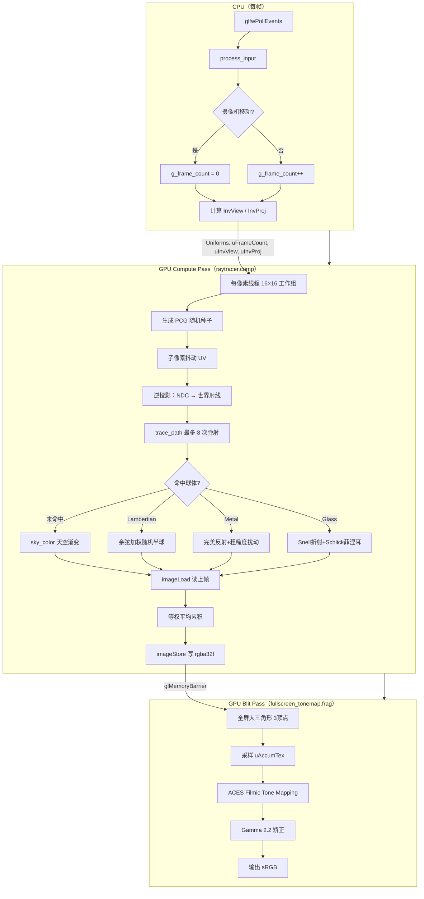
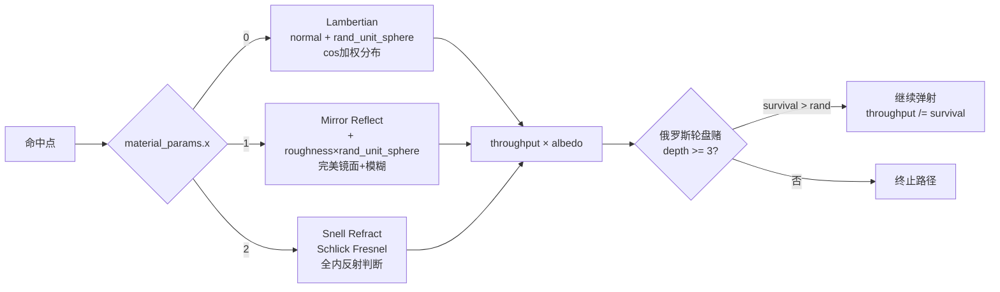
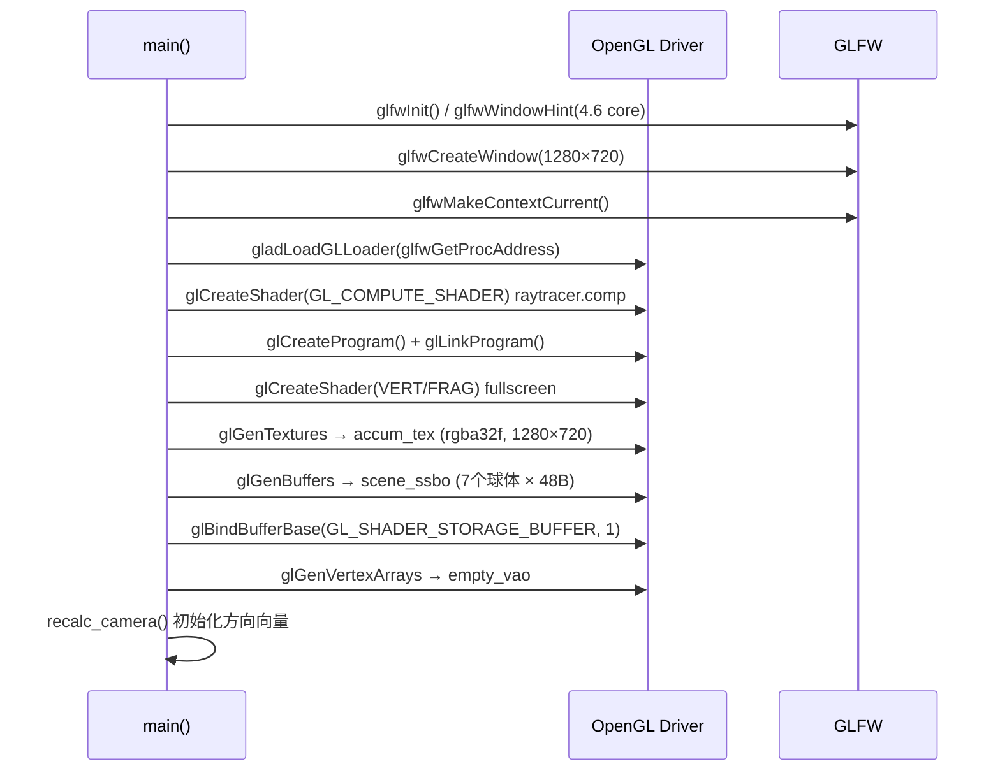
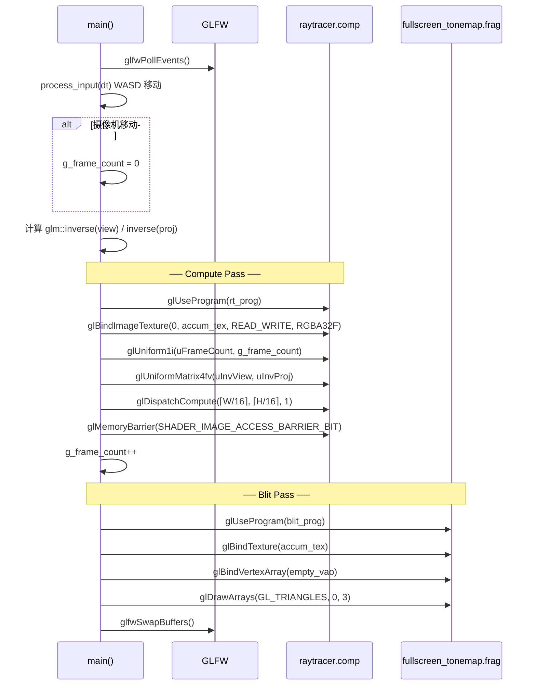
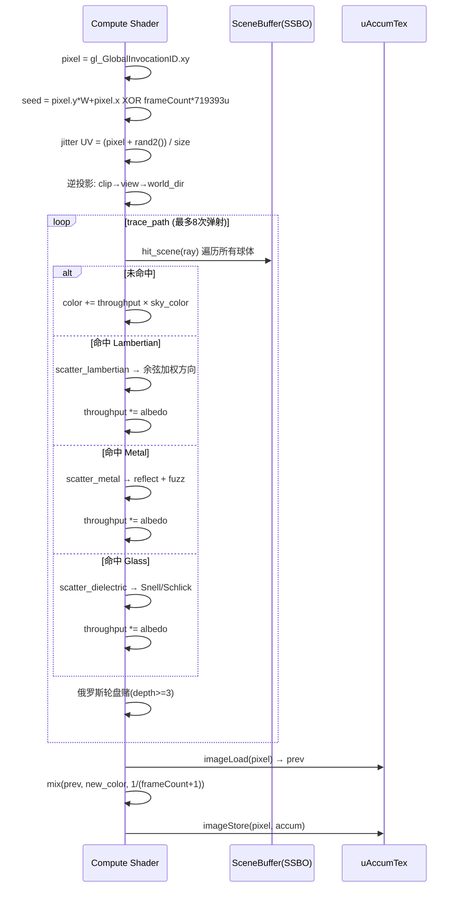

# Module 18 — 路径追踪入门（Path Tracer）

> **阶段 5 · 高级技术**
> 用 OpenGL Compute Shader 实现 GPU 路径追踪：蒙特卡洛积分、渐进式累积、BRDFs 材质模型、ACES 色调映射。

---

## 目录

1. [模块目的与背景](#1-模块目的与背景)
2. [架构图](#2-架构图)
3. [关键类与文件表](#3-关键类与文件表)
4. [核心算法](#4-核心算法)
5. [调用时序图](#5-调用时序图)
6. [关键代码片段](#6-关键代码片段)
7. [设计决策](#7-设计决策)
8. [常见坑](#8-常见坑)
9. [测试覆盖说明](#9-测试覆盖说明)
10. [构建与运行命令](#10-构建与运行命令)
11. [延伸阅读](#11-延伸阅读)

---

## 1. 模块目的与背景

### 1.1 什么是路径追踪？

光栅化渲染（前 17 个模块的基础）是一种「由物体出发投影到屏幕」的算法，擅长实时渲染，但难以自然地模拟全局光照、软阴影、焦散等现象。

**路径追踪（Path Tracing）** 是基于物理的全局光照算法，核心思想是蒙特卡洛积分：

```
L(x, ω_o) = L_e(x, ω_o) + ∫ f_r(x, ω_i, ω_o) L_i(x, ω_i) cos θ_i dω_i
```

- `L_e`：自发光
- `f_r`：BRDF（双向反射分布函数）
- `L_i`：入射辐亮度（递归）

通过随机采样将积分转化为求和，随着帧数增加，噪声逐渐收敛为正确图像。

### 1.2 为什么用 Compute Shader？

| 方案 | 优点 | 缺点 |
|------|------|------|
| CPU 软件光追 | 便于调试 | 速度慢，无法实时 |
| OptiX / DXR | 硬件 RT Core 加速 | 需特定 GPU，不通用 |
| OpenGL Compute Shader | 通用 GL 4.6，无需扩展 | 无专用 BVH 硬件 |
| Vulkan Compute | 底层控制更精细 | 代码量大 |

本模块选择 **OpenGL Compute Shader**，在保持与前 17 模块一致技术栈的前提下实现 GPU 并行路径追踪，每个像素一个线程，16×16 工作组。

### 1.3 本模块实现的特性

- ✅ 蒙特卡洛路径追踪（每帧 1 spp，渐进累积）
- ✅ 三种材质：Lambertian 漫反射、金属反射、玻璃折射
- ✅ Schlick 菲涅耳近似
- ✅ 俄罗斯轮盘赌早期终止（无偏）
- ✅ 子像素抖动 MSAA
- ✅ ACES Filmic 色调映射
- ✅ 交互式摄像机（重置累积）
- ✅ PCG Hash 随机数（GPU 友好）

---

## 2. 架构图

### 2.1 总体渲染管线



### 2.2 材质散射模型



---

## 3. 关键类与文件表

### 3.1 文件结构

```
module18_raytracing_intro/
├── CMakeLists.txt
├── src/
│   └── main.cpp              # 窗口/GL初始化、场景构建、主循环
└── shaders/
    ├── raytracer.comp        # 核心：路径追踪 Compute Shader
    ├── fullscreen.vert       # 全屏大三角形顶点着色器
    └── fullscreen_tonemap.frag  # ACES 色调映射片段着色器
```

### 3.2 关键结构体

#### `GpuSphere`（CPU 侧，与 Compute Shader `Sphere` struct 完全对应）

| 字段 | 类型 | 含义 |
|------|------|------|
| `center_radius` | `vec4` | xyz = 球心世界坐标，w = 半径 |
| `albedo` | `vec4` | rgb = 颜色/反照率，a = 粗糙度（金属用） |
| `material_params` | `vec4` | x = 材质类型（0/1/2），y = 折射率 IOR |

> **对齐规则**：GLSL `std430` 规定 `vec4` 16字节对齐。CPU 侧 `glm::vec4` 自然满足，不需要 `#pragma pack`。

#### `HitRecord`（Compute Shader 内部）

| 字段 | 类型 | 含义 |
|------|------|------|
| `t` | float | 射线参数（命中距离） |
| `pos` | vec3 | 世界空间命中点 |
| `normal` | vec3 | 表面法线（朝射线来向） |
| `front_face` | bool | true = 从外面射入 |
| `mat_type` | int | 材质类型 0/1/2 |
| `albedo` | vec3 | 材质颜色 |
| `roughness` | float | 金属粗糙度 |
| `ior` | float | 折射率 |

### 3.3 GL 对象

| 对象 | 说明 |
|------|------|
| `accum_tex` (GL_TEXTURE_2D, GL_RGBA32F) | 渐进累积缓冲，浮点格式保留高动态范围 |
| `scene_ssbo` (GL_SHADER_STORAGE_BUFFER) | 场景球体数据，binding=1 |
| `empty_vao` | Blit pass 用的空 VAO，gl_VertexID 生成大三角形 |
| `rt_prog` | Compute Shader 程序 |
| `blit_prog` | Vertex + Fragment 程序（色调映射） |

---

## 4. 核心算法

### 4.1 蒙特卡洛路径追踪

渲染方程的蒙特卡洛估计：

```
L_o ≈ (1/N) Σ [f_r(ω_i) · L_i(ω_i) · cos(θ_i)] / pdf(ω_i)
```

**渐进式累积**（等权平均）：

```
E_N = E_{N-1} × (N-1)/N + sample_N / N
    = mix(prev, new_sample, 1/N)
```

实现上用 `uFrameCount` 作为 N：

```glsl
float w = 1.0 / float(uFrameCount + 1);
vec4 accum = mix(prev, vec4(new_color, 1.0), w);
```

每帧只采集 1 spp（每像素 1 条路径），通过跨帧累积实现高 spp。

### 4.2 光线-球体相交（解析解）

方程 `|O + tD - C|² = r²` 展开为：

```
a·t² + 2·b·t + c = 0
a = dot(D, D)
b = dot(D, O-C)     ← 用 half_b 避免 4ac 中的 4
c = dot(O-C, O-C) - r²

discriminant = b² - a·c
```

**选最近根**（t_min = 0.001 避免自相交）：

```
root₁ = (-b - √disc) / a   ← 优先取较小根（正面命中）
root₂ = (-b + √disc) / a   ← 若 root₁ 无效则取 root₂
```

**法线朝向约定**：始终让法线与射线方向相反（`front_face` 记录是否从外射入），材质只需判断 `rec.front_face` 而无需关心法线符号。

### 4.3 材质模型

#### Lambertian 漫反射（余弦加权分布）

```
scatter_dir = normal + rand_unit_sphere()
```

等价于半球面上的余弦加权采样（pdf = cos(θ)/π），与 BRDF f_r = albedo/π 结合后恰好抵消 π，吞吐量乘以 albedo 即可。

#### 金属镜面反射

```
reflect(d, n) = d - 2·dot(d, n)·n
fuzz_dir = reflected + roughness × rand_unit_sphere()
```

`roughness = 0`：完美镜面；`roughness = 1`：接近漫反射。

#### 玻璃折射（Snell 定律）

```
n₁ sin θ₁ = n₂ sin θ₂
refraction_ratio = front_face ? (1/ior) : ior
```

**Schlick 菲涅耳近似**（Schlick 1994）：

```
R₀ = ((n₁-n₂)/(n₁+n₂))²
R(θ) = R₀ + (1-R₀)·(1-cos θ)⁵
```

若 `R(θ) > rand()` 或发生全内反射（`sin θ₂ > 1`），则反射而非折射。

### 4.4 俄罗斯轮盘赌（Russian Roulette）

无偏的随机早期终止策略：

```
depth >= 3 时：
  survival = max(throughput.r, throughput.g, throughput.b)
  if rand() > survival:
      break  ← 终止（期望等于 survival × 继续的贡献）
  throughput /= survival  ← 补偿权重，保持期望不变
```

吞吐量越低（路径已被大量吸收），存活概率越小，避免无意义的深层弹射。

### 4.5 PCG Hash 随机数

```glsl
uint pcg_hash(uint seed) {
    uint state = seed * 747796405u + 2891336453u;
    uint word  = ((state >> ((state >> 28u) + 4u)) ^ state) * 277803737u;
    return (word >> 22u) ^ word;
}
```

**优点**：
- 无状态（纯函数），每次调用给定不同种子即可
- 每像素种子 = `pixel.y * width + pixel.x XOR frame_count * 719393u`
- 保证帧间、像素间随机独立

**与 Wang Hash 对比**（模块 15 使用 Wang Hash）：PCG 统计质量更优（更均匀的频率分布），适合路径追踪的多次采样。

### 4.6 子像素抖动（随机 MSAA）

```glsl
vec2 uv = (vec2(pixel) + vec2(rand_float(seed), rand_float(seed))) / vec2(size);
```

每帧在像素内随机偏移 [0,1) × [0,1)，不同帧覆盖不同子像素位置，累积后自然实现抗锯齿（等效于 N-spp MSAA）。

---

## 5. 调用时序图

### 5.1 初始化阶段



### 5.2 主循环（每帧）



### 5.3 Compute Shader 每像素执行流



---

## 6. 关键代码片段

### 6.1 场景构建（CPU 侧）

```cpp
// ─────────────────────────────────────────────────────────────────────────────
// GpuSphere 布局与 GLSL Sphere struct 完全对应（std430, vec4 对齐）
// 每个球体 = 3 × vec4 = 48 bytes
// ─────────────────────────────────────────────────────────────────────────────
struct GpuSphere {
    glm::vec4 center_radius;    // xyz = 球心,  w = 半径
    glm::vec4 albedo;           // rgb = 颜色,  a = 粗糙度
    glm::vec4 material_params;  // x = 材质类型(0/1/2), y = IOR
};

// 地面：漫反射绿色，半径 100 的大球（视觉上像地平面）
add({0, -100.5f, -1}, 100.0f, {0.5f, 0.8f, 0.3f}, 0.0f, 0 /*diffuse*/);

// 玻璃球：IOR=1.5（BK7 光学玻璃），从外透视看到背景
add({-1.2f, 0.0f, -2.0f}, 0.5f, {1.0f, 1.0f, 1.0f}, 0.0f, 2 /*glass*/, 1.5f);
```

### 6.2 累积纹理创建（rgba32f）

```cpp
// ─────────────────────────────────────────────────────────────────────────────
// 必须使用 GL_RGBA32F（32位浮点），原因：
// 1. HDR 路径追踪的辐亮度值可能 >> 1.0
// 2. 多帧平均需要足够精度，GL_RGBA8 会有严重量化误差
// 3. imageStore 写入需要 image format 匹配（GL_RGBA32F, binding=0）
// ─────────────────────────────────────────────────────────────────────────────
glTexImage2D(GL_TEXTURE_2D, 0,
             GL_RGBA32F,          // ← 内部格式：32位浮点 RGBA
             g_width, g_height,
             0,
             GL_RGBA, GL_FLOAT,   // ← 初始数据格式（nullptr = 不上传）
             nullptr);

// MIN/MAG 必须是 NEAREST（路径追踪不需要插值，且 image2D 不支持 mip）
glTexParameteri(GL_TEXTURE_2D, GL_TEXTURE_MIN_FILTER, GL_NEAREST);
glTexParameteri(GL_TEXTURE_2D, GL_TEXTURE_MAG_FILTER, GL_NEAREST);
```

### 6.3 Compute Shader 调度与同步

```cpp
// ─────────────────────────────────────────────────────────────────────────────
// Compute Pass：以 16×16 工作组覆盖整个屏幕
// ─────────────────────────────────────────────────────────────────────────────
glUseProgram(rt_prog);

// 将累积纹理绑定为 image unit 0（READ_WRITE：先读后写）
glBindImageTexture(0, accum_tex, 0, GL_FALSE, 0, GL_READ_WRITE, GL_RGBA32F);

// 场景 SSBO 绑定到 binding=1（与 shader 中 layout(..., binding=1) 对应）
glBindBufferBase(GL_SHADER_STORAGE_BUFFER, 1, scene_ssbo);

// 传递帧计数（用于随机种子 + 等权平均计算）
glUniform1i(glGetUniformLocation(rt_prog, "uFrameCount"), g_frame_count);

// 传递逆变换矩阵（在 shader 中重建世界空间射线）
glUniformMatrix4fv(glGetUniformLocation(rt_prog, "uInvView"), 1, GL_FALSE,
                   glm::value_ptr(inv_view));
glUniformMatrix4fv(glGetUniformLocation(rt_prog, "uInvProj"), 1, GL_FALSE,
                   glm::value_ptr(inv_proj));

// 工作组数量向上取整：(width + 15) / 16
int gx = (g_width  + 15) / 16;
int gy = (g_height + 15) / 16;
glDispatchCompute(gx, gy, 1);

// ─────────────────────────────────────────────────────────────────────────────
// 内存屏障：确保 imageStore 的写入在 Blit Pass 的 texture() 采样前完成
// 缺少此 barrier 会导致 Blit Pass 读到脏数据（不确定的竞争）
// ─────────────────────────────────────────────────────────────────────────────
glMemoryBarrier(GL_SHADER_IMAGE_ACCESS_BARRIER_BIT);
```

### 6.4 相机射线重建（Compute Shader）

```glsl
// ─────────────────────────────────────────────────────────────────────────────
// 在 Compute Shader 中从 NDC 重建世界空间射线
// 步骤：
//   1. UV [0,1] + 抖动 → NDC [-1,1]
//   2. NDC → 视图空间方向（用逆投影矩阵）
//   3. 视图空间 → 世界空间（用逆视图矩阵）
// ─────────────────────────────────────────────────────────────────────────────

// 子像素抖动：rand_float 给 [0,1)，不同帧落在不同位置（随机 MSAA）
vec2 uv = (vec2(pixel) + vec2(rand_float(seed), rand_float(seed))) / vec2(size);
uv = uv * 2.0 - 1.0;  // [0,1] → [-1,1]

// 逆投影：clip_dir = (u, v, -1, 1)，-1 是近平面
vec4 clip_dir = vec4(uv, -1.0, 1.0);
vec4 view_dir = uInvProj * clip_dir;

// 注意：view_dir.w 是透视除法产生的，强制设 w=0（方向向量）
view_dir = vec4(view_dir.xy, -1.0, 0.0);

// 变换到世界空间
vec3 world_dir = normalize((uInvView * view_dir).xyz);

// 相机位置从逆视图矩阵第4列提取（view = [R|t], inv_view = [Rᵀ|-Rᵀt]）
// inv_view[3] = (cam_pos.x, cam_pos.y, cam_pos.z, 1.0)
vec3 cam_pos = vec3(uInvView[3]);
```

### 6.5 俄罗斯轮盘赌（无偏早期终止）

```glsl
// ─────────────────────────────────────────────────────────────────────────────
// 俄罗斯轮盘赌（Russian Roulette）
// 深度 >= 3 后，以 1-survival 的概率终止路径
// survival = max 通道亮度（throughput 越暗越容易终止）
// 补偿：throughput /= survival  → 期望值保持不变（无偏估计）
// ─────────────────────────────────────────────────────────────────────────────
if (depth >= 3) {
    float survival = max(throughput.r, max(throughput.g, throughput.b));

    // 若 survival 极小（路径已被大量吸收），大概率提前终止
    if (rand_float(seed) > survival) break;

    // 幸存路径：补偿权重以保持期望不变
    // E[contribution] = survival × (contribution / survival) = contribution ✓
    throughput /= survival;
}
```

### 6.6 ACES Filmic 色调映射

```glsl
// ─────────────────────────────────────────────────────────────────────────────
// ACES Filmic Tone Mapping（Narkowicz 近似，2015）
// 原始 ACES 需要完整 RRT+ODT 变换矩阵，此近似以低成本还原电影感曲线
// 输入：线性 HDR 颜色（可能 >> 1.0）
// 输出：[0,1] LDR（S 形曲线：高光压缩 + 阴影提升）
// ─────────────────────────────────────────────────────────────────────────────
vec3 aces_tonemap(vec3 x) {
    const float a = 2.51, b = 0.03, c = 2.43, d = 0.59, e = 0.14;
    // 有理函数 f(x) = (ax² + bx) / (cx² + dx + e)
    return clamp((x * (a*x + b)) / (x * (c*x + d) + e), 0.0, 1.0);
}

void main() {
    vec2 uv = gl_FragCoord.xy / vec2(textureSize(uAccumTex, 0));
    vec3 hdr = texture(uAccumTex, uv).rgb;       // 线性 HDR
    vec3 ldr = aces_tonemap(hdr);                 // 映射到 [0,1]
    vec3 out_ = pow(ldr, vec3(1.0 / 2.2));       // Linear → sRGB gamma
    FragColor = vec4(out_, 1.0);
}
```

---

## 7. 设计决策

### 7.1 为什么用 Compute Shader 而非 Fragment Shader？

| 对比项 | Compute Shader | Fragment Shader |
|--------|---------------|-----------------|
| 随机写入 | `imageStore` 任意位置 | `gl_FragCoord` 固定位置 |
| 共享内存 | `shared` 变量（L1 缓存）| 无 |
| 工作组同步 | `barrier()` 可用 | 无 |
| 路径追踪适配性 | 高（可在 shader 内做多次弹射） | 需多 FBO pass |

本模块不需要共享内存，但 Compute Shader 的 `imageStore` 允许随机写入——为未来实现 splat（光子映射等）留余地。

### 7.2 为什么不实现 BVH？

| 对比项 | 线性搜索 | BVH |
|--------|---------|-----|
| 实现复杂度 | 低（20 行） | 高（200+ 行 + GPU 指针遍历） |
| 性能（7 球体） | 7 次相交测试 | 3-4 次 |
| 性能（100 球体） | 100 次 | ~7 次 |

本模块仅 7 个球体，线性搜索足够。生产级路径追踪需要 BVH（详见延伸阅读）。

### 7.3 为什么使用等权平均而非指数移动平均？

| 方案 | 公式 | 特点 |
|------|------|------|
| 等权平均 | `mix(prev, new, 1/N)` | 无偏，收敛到真值，但早期帧权重随 N 增大而消失 |
| 指数移动平均 | `mix(prev, new, α)` | α 固定，始终记住近期采样，但无法收敛（有偏） |

路径追踪追求无偏收敛，选等权平均。缺点是摄像机移动后需要 `g_frame_count = 0` 重置。

### 7.4 为什么相机射线用逆矩阵重建而非直接传入射线方向？

**直接传方向**的问题：
- 需要 CPU 为每个像素计算射线（无法利用 GPU 并行）
- 传入方向数组需要额外缓冲区

**逆矩阵重建**：
- 只需传 2 个 4×4 矩阵（128 bytes Uniform）
- 每个 GPU 线程自行从 gl_GlobalInvocationID 计算像素 UV，再逆投影
- 天然并行，且结合子像素抖动时灵活

### 7.5 为什么选择 PCG Hash 而非 Wang Hash（模块 15）？

| 指标 | PCG Hash | Wang Hash |
|------|---------|---------|
| 均匀性 | 极佳（通过 BigCrush 测试） | 良好 |
| 相关性 | 极低 | 低 |
| 成本 | 5 ops（乘法+移位） | 4 ops |
| 路径追踪适用性 | 高（多次调用仍高质量） | 中（连续调用有轻微相关） |

路径追踪每条路径调用随机数数十次，PCG 的更高统计质量可以减少可见噪声。

### 7.6 关于最大弹射深度 MAX_DEPTH = 8

| 深度 | 场景示例 | 效果 |
|------|---------|------|
| 1 | 直接光照 | 正确漫反射，无间接光 |
| 4 | 单次镜面反射+漫反射 | 大多数场景足够 |
| 8 | 玻璃球内多次全内反射 | 玻璃材质需要 |
| 无限 | 金属球阵列 | 性能问题，俄罗斯轮盘赌代替 |

配合俄罗斯轮盘赌（depth >= 3 启动），实践中大多数路径在 3-5 次弹射后自然终止。

---

## 8. 常见坑

### 坑 1：缺少 glMemoryBarrier，Blit Pass 读到脏数据

```cpp
// ❌ 错误：直接绘制，imageStore 的写入可能尚未完成
glDispatchCompute(gx, gy, 1);
// ... 直接 blit ...
glDrawArrays(GL_TRIANGLES, 0, 3);   // 竞争条件！

// ✅ 正确：插入 image access barrier
glDispatchCompute(gx, gy, 1);
glMemoryBarrier(GL_SHADER_IMAGE_ACCESS_BARRIER_BIT);
glDrawArrays(GL_TRIANGLES, 0, 3);
```

**症状**：图像闪烁，部分像素显示上一帧或随机值。

### 坑 2：累积纹理使用 GL_RGBA8 导致量化误差累积

```cpp
// ❌ 错误：8位格式，HDR 值被截断到 [0,1]，精度严重不足
glTexImage2D(GL_TEXTURE_2D, 0, GL_RGBA8, ...);

// ✅ 正确：32位浮点格式，保留 HDR 精度
glTexImage2D(GL_TEXTURE_2D, 0, GL_RGBA32F, ...);
```

**症状**：高光区域（亮度 > 1.0）提前截断；多帧累积后出现明显色带。

### 坑 3：忘记在摄像机移动时重置 g_frame_count

```cpp
// ❌ 错误：移动后继续累积旧帧
if (glfwGetKey(win, GLFW_KEY_W) == GLFW_PRESS) {
    g_cam_pos += g_cam_front * speed;
    // 忘记重置！
}

// ✅ 正确：移动/旋转后立即重置
bool moved = false;
if (glfwGetKey(win, GLFW_KEY_W) == GLFW_PRESS) {
    g_cam_pos += g_cam_front * speed;
    moved = true;
}
if (moved) g_frame_count = 0;
```

**症状**：移动摄像机后出现"鬼影"，新旧位置的图像叠加。

### 坑 4：法线方向错误导致自相交（Shadow Acne）

```glsl
// ❌ 错误：t_min = 0.0，射线原点数值误差导致立即与自身相交
hit_sphere_obj(r, spheres[i], 0.0, t_max, tmp)

// ✅ 正确：t_min = 0.001，跳过自相交
hit_sphere_obj(r, spheres[i], 0.001, t_max, tmp)
```

**症状**：球体表面出现随机黑斑（Shadow Acne），在漫反射材质上尤为明显。

### 坑 5：玻璃球内部法线方向处理错误

```glsl
// ❌ 错误：折射计算直接用 outward_normal，不考虑射线从内部射出的情况
vec3 normal = (rec.pos - sphere_center) / radius;  // 永远朝外

// ✅ 正确：根据 front_face 翻转法线
rec.front_face = dot(r.dir, outward_normal) < 0.0;
rec.normal     = rec.front_face ? outward_normal : -outward_normal;

// 折射率也需要根据朝向调整
float refraction_ratio = rec.front_face ? (1.0 / rec.ior) : rec.ior;
```

**症状**：玻璃球内部光线折射方向错误，球体显示为全黑或全白。

### 坑 6：Lambertian 散射方向退化

```glsl
// ❌ 错误：当 rand_unit_sphere() 刚好与法线反向时，scatter_dir ≈ 0
vec3 scatter_dir = rec.normal + rand_unit_sphere(seed);
// 直接使用，可能导致 NaN

// ✅ 正确：检测退化并回退到法线方向
if (length(scatter_dir) < 1e-5) scatter_dir = rec.normal;
return Ray(rec.pos, normalize(scatter_dir));
```

**症状**：偶发 NaN 像素（显示为黑色或粉色），统计上约 1/1000 帧出现。

### 坑 7：Compute Shader image uniform 格式不匹配

```cpp
// ❌ 错误：绑定时格式与声明不符
glBindImageTexture(0, accum_tex, 0, GL_FALSE, 0, GL_READ_WRITE, GL_RGBA16F);
// Shader 中声明 layout(rgba32f, binding=0)

// ✅ 正确：CPU 侧格式必须与 shader layout 完全一致
glBindImageTexture(0, accum_tex, 0, GL_FALSE, 0, GL_READ_WRITE, GL_RGBA32F);
```

**症状**：GL_INVALID_OPERATION 错误，Compute Shader 无法写入纹理。

### 坑 8：分辨率改变后不重建累积纹理

```cpp
// ❌ 错误：窗口大小改变后继续使用旧尺寸的纹理
// imageSize(uAccumTex) 返回旧尺寸，边界之外的像素 gl_GlobalInvocationID 越界

// ✅ 正确：检测尺寸不匹配时重建
if (tw != g_width || th != g_height) {
    glTexImage2D(GL_TEXTURE_2D, 0, GL_RGBA32F, g_width, g_height,
                 0, GL_RGBA, GL_FLOAT, nullptr);
    g_frame_count = 0;  // 重置累积
}
```

**症状**：拉伸窗口后出现图像扭曲或越界访问（驱动层面可能静默失败）。

### 坑 9：等权平均 uFrameCount 从 0 开始还是从 1 开始

```glsl
// ❌ 错误：frameCount=0 时分母为 0
float w = 1.0 / float(uFrameCount);       // 当 uFrameCount=0 时 w=INF!

// ✅ 正确：分母加 1，初帧 w=1.0（完全替换为新样本）
float w = 1.0 / float(uFrameCount + 1);
// frameCount=0: w=1.0 → 直接写入新样本（prev 是未初始化的 0，mix(0, new, 1) = new）
// frameCount=1: w=0.5 → 等权平均两帧
```

---

## 9. 测试覆盖说明

### 9.1 视觉验证清单

| 测试项 | 预期现象 | 实际验证方法 |
|--------|---------|-------------|
| 冷启动 | 第 1 帧噪声极多，随帧数收敛 | 观察标题栏 `Samples: N` 增长 |
| 漫反射球 | 产生柔和颜色渗色（Color Bleeding） | 蓝色球旁应有蓝色光晕投影在地面 |
| 玻璃球 | 背景穿透折射，边缘反射高光 | 折射背景应左右翻转（IOR 效应） |
| 金属球（低粗糙度）| 清晰镜面反射 | 地面绿色反射在金属球上 |
| 金属球（高粗糙度）| 模糊反射 | 不同 roughness 差异明显 |
| 摄像机移动后重置 | 立即出现高噪声，随后收敛 | RMB+WASD 移动后观察 |
| 窗口缩放 | 不出现鬼影、不崩溃 | 拖动窗口边框 |
| 按 R 重置 | samples 归零，图像重新收敛 | 按 R 观察 |

### 9.2 收敛速度参考

| 采样数 | 预期噪声水平 |
|--------|------------|
| 1-10 spp | 极度噪声，轮廓隐约可见 |
| 50-100 spp | 噪声明显但结构清晰 |
| 500 spp | 低噪声，阴影和折射清晰 |
| 2000+ spp | 视觉上干净（参考质量） |

### 9.3 性能参考（1280×720）

| GPU | 预期 FPS（= spp/s） | 达到 1000 spp 时间 |
|-----|---------------------|------------------|
| GTX 1060 | ~15-20 fps | ~50s |
| RTX 2070 | ~40-60 fps | ~20s |
| RTX 3080 | ~80-120 fps | ~10s |

### 9.4 Shader 编译验证

构建时会自动运行 `glGetShaderiv(GL_COMPILE_STATUS)`，编译错误打印到 stderr。常见错误：

```
Shader compile error:
0(75) : error C1503: undefined variable "rand_unit_hemisphere"
```

→ 检查函数名是否拼写正确（本模块使用 `rand_hemisphere`）。

---

## 10. 构建与运行命令

### 10.1 依赖安装

```bash
# 本模块只需 GLFW + GLAD + GLM（均由 ogl_common 提供，无额外依赖）
sudo apt install build-essential cmake libgl1-mesa-dev libx11-dev libxrandr-dev
```

### 10.2 构建

```bash
# 全项目构建
cd /home/aoi/AWorkSpace/ogl_mastery
CXX=g++-10 CC=gcc-10 cmake -B build -DCMAKE_BUILD_TYPE=Release
cmake --build build --target module18_raytracing_intro -j$(nproc)

# Debug 构建（GL 错误输出更详细）
CXX=g++-10 CC=gcc-10 cmake -B build_debug -DCMAKE_BUILD_TYPE=Debug
cmake --build build_debug --target module18_raytracing_intro -j$(nproc)
```

### 10.3 运行

```bash
cd build   # 必须在 build 目录运行，shader 路径是相对路径
./module18_raytracing_intro
```

### 10.4 操作控制

| 操作 | 效果 |
|------|------|
| `RMB`（右键按住）| 进入摄像机控制模式 |
| `RMB + 鼠标移动` | 旋转摄像机（偏航/俯仰） |
| `RMB + WASD` | 前后左右移动 |
| `R` | 重置累积（Samples 归零） |
| `ESC` | 退出 |
| 拉伸窗口 | 自动调整分辨率并重置累积 |

> **注意**：移动摄像机后采样数会立即归零，稍等 1-2 秒待图像收敛后再截图。

### 10.5 调整场景

在 `src/main.cpp` 的 `build_scene()` 函数中：

```cpp
// 修改球体位置/材质/IOR
add({x, y, z},    // 球心
    radius,        // 半径
    {r, g, b},     // 颜色（线性空间）
    roughness,     // 0=光滑, 1=粗糙（仅金属有效）
    mat_type,      // 0=漫反射, 1=金属, 2=玻璃
    ior);          // 折射率（仅玻璃有效，典型值 1.5）
```

---

## 11. 延伸阅读

### 11.1 基础理论

| 资源 | 内容 |
|------|------|
| Peter Shirley, "Ray Tracing in One Weekend" | 本模块算法来源，免费在线 |
| "Physically Based Rendering: From Theory to Implementation" (PBRT v4) | 工业级路径追踪全书 |
| Veach 博士论文 "Robust Monte Carlo Methods" | MIS、双向路径追踪理论基础 |
| Heitz "Understanding the Masking-Shadowing Function" | GGX/VNDF 高级微面元 BRDF |

### 11.2 GPU 路径追踪进阶

| 技术 | 描述 | 参考 |
|------|------|------|
| BVH（SAH 构建） | 将场景搜索从 O(N) 降为 O(log N) | "Fast BVH Construction on GPUs" |
| 下一事件估计（NEE） | 直接采样光源，减少高光噪声 | PBRT Chapter 13 |
| 多重重要性采样（MIS） | 组合 BRDF 采样和光源采样 | Veach 1997 |
| OIDN/Optix Denoiser | AI 降噪，1 spp 达到 64 spp 效果 | Intel Open Image Denoise |
| ReSTIR | 实时动态场景路径追踪 | SIGGRAPH 2020 |
| Vulkan Ray Tracing | VK_KHR_ray_tracing_pipeline，硬件 BVH | Vulkan Spec |

### 11.3 课程内关联模块

| 模块 | 关联点 |
|------|--------|
| Module 15 (GPU Particles) | Compute Shader + SSBO + glMemoryBarrier 相同模式 |
| Module 12 (Deferred Shading) | G-Buffer 思想 vs 路径追踪：完全不同的全局光照路线 |
| Module 13 (PBR) | 本模块的材质模型（Lambertian/GGX）与 PBR 的关系 |

### 11.4 ACES 色调映射

- Narkowicz, "ACES Filmic Tone Mapping Curve" (2015) — 本模块实现来源
- Hill & Alexa, "Rendering the World of Far Cry 4" — 工业级色调映射流程
- 原始 ACES CTL 实现：`github.com/ampas/aces-dev`

---

*Module 18 是 ogl_mastery 课程的最后一个模块，将 Compute Shader、SSBO、全屏后处理等前序知识融为一体，
用不到 300 行 C++ + 280 行 GLSL 实现了一个完整的 GPU 路径追踪器。
建议在掌握前 17 个模块后再回头细读本模块，体会从光栅化到光线追踪的范式转变。*
